# DealMap AI — Real-Time Food Discovery & Community Intelligence Platform

## COS30043 — Interface Design and Development
### High Distinction Project Proposal & Implementation Blueprint

---

# 1. PRODUCT VISION

## Vision Statement

DealMap AI is a real-time geospatial platform that connects communities with discounted and near-expiry food products. By combining live community intelligence, interactive map exploration, and transaction-safe reservation mechanics, the platform reduces food waste while helping users save money — all delivered through a premium, minimalist interface.

## Core Value Proposition

| Principle | Application |
|---|---|
| Real-Time First | Every interaction is live — deals, reservations, verifications, comments |
| Community-Powered | Users drive content quality through trust scoring and verification |
| Geospatial-First | Map-based discovery as the primary navigation paradigm |
| Performance Obsession | Virtual scrolling, viewport culling, optimistic updates |
| Accessibility by Default | WCAG 2.1 AA compliance across all states and interactions |

## Guiding Design Philosophy

> "The best interface is the one that disappears. DealMap AI prioritises content discovery over chrome, speed over features, and clarity over complexity."

---

# 2. PROBLEM STATEMENT

## The Food Waste Crisis

- **1.3 billion tonnes** of food are wasted globally each year
- **30–40%** of the food supply in developed nations goes unsold
- **$1 trillion** in economic losses annually
- Supermarkets discard near-expiry products despite being perfectly edible
- Consumers lack real-time visibility into local discounted food availability
- Existing solutions are static, non-interactive, and fail to build community trust

## The UX Gap

| Problem | Impact |
|---|---|
| Static deal listings | Users cannot trust freshness of information |
| No real-time reservation | Leads to disappointment and wasted trips |
| Poor mobile experience | Primary use case is on-the-go discovery |
| No community verification | Scams and expired deals erode trust |
| Complex checkout flows | High abandonment rates |
| No personalisation | Users see irrelevant deals |

## How DealMap AI Solves This

1. **Real-time map** — See deals as they are posted within your viewport
2. **Instant reservation** — Secure items before travelling with optimistic locking
3. **Community trust** — Verification badges, trust scores, and moderation
4. **Premium UX** — Skeleton screens, micro-interactions, dark mode
5. **AI-assisted discovery** — Upload a photo, find matching deals nearby

---

# 3. USER PERSONAS

## Persona 1 — Sarah, The Budget-Conscious Student

| Attribute | Detail |
|---|---|
| Age | 20 |
| Occupation | University Student |
| Tech Literacy | High |
| Goals | Find cheap food near campus, reduce grocery bills |
| Pain Points | Misses deals posted hours ago; no way to reserve items |
| Behaviour | Mobile-first, checks deals between classes, impulsive |
| Accessibility | No impairments |

**Quote:** *"I need to know if something is still available BEFORE I walk to the store."*

## Persona 2 — David, The Community-Minded Parent

| Attribute | Detail |
|---|---|
| Age | 38 |
| Occupation | Teacher |
| Tech Literacy | Medium |
| Goals | Reduce food waste, teach sustainability to his kids |
| Pain Points | Frustrated by expired deals still showing; wants to contribute |
| Behaviour | Evening user, desktop-primary, writes reviews and verifies deals |
| Accessibility | Mild colour blindness (needs accessible colour schemes) |

**Quote:** *"I want to help my community waste less food, but I need to know the information is reliable."*

## Persona 3 — Priya, The Store Manager (Moderator)

| Attribute | Detail |
|---|---|
| Age | 45 |
| Occupation | Grocery Store Manager |
| Tech Literacy | Low |
| Goals | Clear near-expiry stock quickly, reduce waste write-offs |
| Pain Points | Manual markdowns take too long; no digital channel |
| Behaviour | Uses tablet, posts deals in batches, rarely browses |
| Accessibility | Prefers larger touch targets |

**Quote:** *"If I can post a deal in under 30 seconds, I'll use this every day."*

## Persona 4 — Marcus, The Admin / Platform Analyst

| Attribute | Detail |
|---|---|
| Age | 31 |
| Occupation | Platform Operations |
| Tech Literacy | Expert |
| Goals | Monitor platform health, detect abuse, generate insights |
| Pain Points | No visibility into live activity; manual moderation |
| Behaviour | Dashboard-driven, uses analytics to make decisions |
| Accessibility | No impairments |

**Quote:** *"I need to see what's happening on the platform RIGHT NOW."*

---

# 4. USER STORIES

## Stage 1 — Foundation

| ID | Story | Priority |
|---|---|---|
| US-01 | As a visitor, I want to see a beautiful landing page so that I understand the platform's purpose. | P0 |
| US-02 | As a visitor, I want to browse news articles about food waste so that I stay informed. | P0 |
| US-03 | As a visitor, I want to search news by date, title, content, and category so that I find relevant information. | P0 |
| US-04 | As a visitor, I want paginated news results so that I can browse efficiently. | P0 |
| US-05 | As a visitor, I want to filter news by category so that I narrow down topics. | P0 |
| US-06 | As a visitor, I want to see an About page with a dynamic greeting based on my name so that I feel welcomed. | P0 |
| US-07 | As a visitor, I want radio buttons to switch between "Food Rescue" and "Community Support" imagery so that I can change the visual context. | P0 |
| US-08 | As a visitor, I want the site to work on mobile, tablet, and desktop so that I can access it from any device. | P0 |

## Stage 2 — Core Application

| ID | Story | Priority |
|---|---|---|
| US-09 | As a user, I want to register an account so that I can participate in the community. | P0 |
| US-10 | As a user, I want to log in and log out so that I can manage my session. | P0 |
| US-11 | As a user, I want protected routes so that unauthenticated users cannot access certain pages. | P0 |
| US-12 | As a guest, I want to browse deals so that I can see what's available without an account. | P0 |
| US-13 | As a registered user, I want to create a deal so that I can share discounted food with others. | P0 |
| US-14 | As a registered user, I want to edit and delete my deals so that I can manage my listings. | P0 |
| US-15 | As a registered user, I want to search, filter, and sort deals so that I find what I need. | P0 |
| US-16 | As a registered user, I want to like, vote, bookmark, and comment on deals so that I can engage with content. | P0 |
| US-17 | As a moderator, I want to verify deals so that the community trusts the listings. | P0 |
| US-18 | As an admin, I want to manage users and deals so that I keep the platform healthy. | P0 |

## Stage 3 — Advanced Features

| ID | Story | Priority |
|---|---|---|
| US-19 | As a user, I want to see deals on an interactive map so that I find food near me. | P0 |
| US-20 | As a user, I want map markers to update in real-time so that I see new deals instantly. | P0 |
| US-21 | As a user, I want marker clustering so that dense areas are readable. | P0 |
| US-22 | As a user, I want a heatmap view so that I understand deal density. | P0 |
| US-23 | As a user, I want only visible-map deals to render so that performance stays smooth. | P0 |
| US-24 | As a user, I want virtualised deal lists so that scrolling thousands of deals is smooth. | P0 |
| US-25 | As a user, I want dynamic map filtering so that results update instantly. | P0 |
| US-26 | As a user, I want a live activity stream so that I see community actions without refreshing. | P0 |
| US-27 | As a user, I want to reserve food items with quantity management so that I don't miss out. | P0 |
| US-28 | As a user, I want reservation countdown timers so that I know when my hold expires. | P0 |
| US-29 | As a user, I want the reservation system to prevent overselling so that I can trust availability. | P0 |
| US-30 | As a user, I want a live event dashboard showing platform activity so that I see community momentum. | P1 |
| US-31 | As a user, I want to upload a food image and get matching deals so that I can find food visually. | P1 |
| US-32 | As a user, I want dark mode so that I can use the app comfortably at night. | P1 |
| US-33 | As a user, I want skeleton screens and loading states so that I know content is loading. | P1 |

---

# 5. USE CASES

## UC-01: Browse Map Deals

```
Actor: Guest / Registered User
Trigger: User navigates to /explore
Precondition: Map service is loaded
Postcondition: Map displays deals within viewport

Flow:
1. System initialises Mapbox with default bounds
2. System loads deals via GET /api/deals?bounds=...
3. System applies viewport culling (only render markers within current view)
4. System renders clustered markers using supercluster algorithm
5. User pans/zooms → system refetches bounds and re-renders
6. If Socket.IO connected → system listens for new deal events
7. On new deal → marker added dynamically without page refresh

Alternative: No deals in viewport → display empty state with illustration
```

## UC-02: Reserve Food Item

```
Actor: Registered User
Trigger: User clicks "Reserve" on a deal
Precondition: Item has remaining_qty > 0
Postcondition: Reservation created with 15-minute hold

Flow:
1. System checks remaining_qty
2. System begins database transaction
3. System applies optimistic lock via version column
4. SELECT ... WHERE id = X AND version = V
5. INSERT into reservations table
6. UPDATE deals SET remaining_qty = remaining_qty - 1, version = version + 1
7. COMMIT
8. System emits socket event: deal:updated
9. UI updates quantity in real-time for all users
10. Client starts 15-minute countdown timer
11. On timer expiry → system cancels reservation and restores quantity

Error: OptimisticLockException → UI shows "Item no longer available"
Error: remaining_qty = 0 → UI shows "Sold out" with disabled button
```

## UC-03: Verify Deal (Moderator)

```
Actor: Moderator
Trigger: Moderator opens deal detail while in moderation mode
Precondition: User has role: moderator or admin
Postcondition: Deal.verified = true

Flow:
1. System presents verification badge on unverified deals
2. Moderator clicks "Verify Deal"
3. POST /api/deals/:id/verify
4. System sets verified = true, verified_by = moderator.id
5. System recalculates store trust score
6. System emits socket event: deal:verified
7. All connected clients see verification badge appear instantly
```

## UC-04: AI Image Search

```
Actor: Registered User
Trigger: User navigates to /ai-search, uploads an image
Precondition: Image is valid format (PNG, JPG, WEBP)
Postcondition: System displays matching deals

Flow:
1. User drags/clicks to upload image
2. System displays image preview with loading skeleton
3. Image sent to POST /api/ai/search (multipart)
4. Backend sends image to AI vision model
5. AI detects food category with confidence score
6. System queries deals matching detected category
7. Results returned with: image, matched category, confidence %, deal cards
8. UI animates results in — each card staggered entrance
9. Map zooms to show matched deal locations

Error: AI confidence < 60% → display "Could not identify food. Try a clearer image."
Error: No matching deals → display empty state with suggestion
```

---

# 6. INFORMATION ARCHITECTURE

## Content Hierarchy

```
DealMap AI
├── Public
│   ├── Home (Landing Page)
│   │   ├── Hero Banner
│   │   ├── Featured Deals (live)
│   │   ├── How It Works
│   │   ├── Live Stats Bar
│   │   └── Call to Action
│   ├── News
│   │   ├── Search Bar
│   │   ├── Category Filters
│   │   ├── Article List (paginated)
│   │   └── Article Detail
│   ├── About
│   │   ├── Project Description
│   │   ├── Dynamic Greeting
│   │   ├── Radio Toggle (Food Rescue / Community Support)
│   │   └── Dynamic Image Display
│   └── Explore (Map)
│       ├── Interactive Map
│       │   ├── Clustered Markers
│       │   ├── Heatmap Layer
│       │   └── Viewport Controls
│       ├── Deal Sidebar
│       │   ├── Search / Filter / Sort
│       │   └── Virtualized Deal List
│       └── Deal Detail Panel
│           ├── Images
│           ├── Expiry Countdown
│           ├── Trust Score
│           ├── Reservation Controls
│           └── Comments
├── Authenticated
│   ├── My Profile
│   │   ├── My Deals (CRUD)
│   │   ├── My Reservations
│   │   ├── My Bookmarks
│   │   ├── Trust Score
│   │   └── Activity History
│   ├── AI Search
│   │   ├── Image Upload
│   │   ├── Recognition Result
│   │   └── Matching Deals
│   └── Community Feed
│       ├── Live Activity Stream
│       ├── New Deal Posts
│       └── Comment Threads
├── Admin
│   ├── Analytics Dashboard
│   │   ├── Live Event Charts
│   │   ├── User Metrics
│   │   └── Deal Metrics
│   └── Admin Panel
│       ├── User Management
│       ├── Deal Moderation
│       └── System Settings
└── Auth
    ├── Login
    └── Register
```

---

# 7. SITEMAP

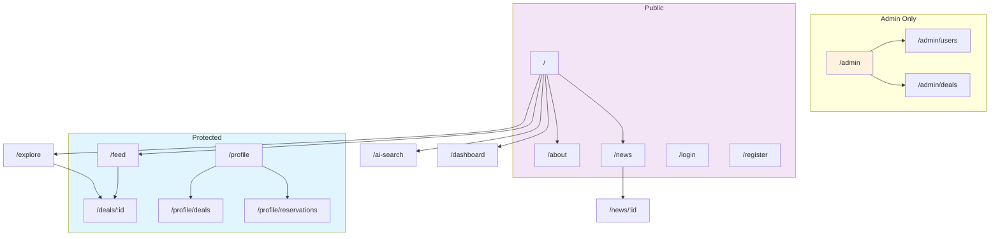

---

# 8. USER FLOW

## Primary Flow: Deal Discovery → Reservation

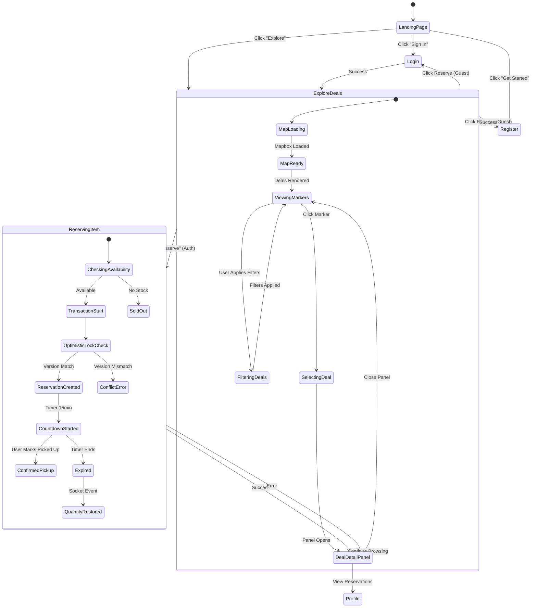

## Secondary Flow: AI Image Search

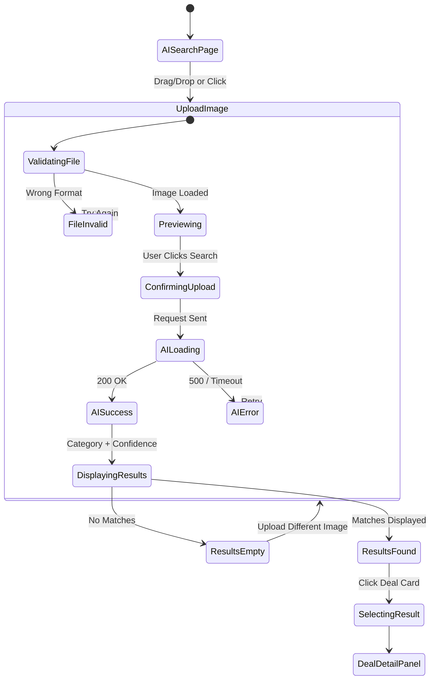

---

# 9. WIREFRAMES

## 9.1 Landing Page — Desktop

```
┌────────────────────────────────────────────────────────────────────┐
│ [Logo] DealMap AI              [Explore] [About] [Sign In]         │
├────────────────────────────────────────────────────────────────────┤
│                                                                    │
│  ┌──────────────────────────────────────────────────────────┐      │
│  │                                                          │      │
│  │  🎯 Discover Fresh Deals.                                │      │
│  │     Near You. Now.                                       │      │
│  │                                                          │      │
│  │  [Enter your location]  [🔍 Explore Deals]               │      │
│  │                                                          │      │
│  │  ✨ Live: 234 deals · 89 reservations · 12 new today     │      │
│  │                                                          │      │
│  │  ┌────────────┐  ┌────────────┐                         │      │
│  │  │ Food Image  │  │ Food Image │                         │      │
│  │  │ (Fresh      │  │ (Community)│                         │      │
│  │  │  Produce)   │  │            │                         │      │
│  │  └────────────┘  └────────────┘                         │      │
│  │                                                          │      │
│  └──────────────────────────────────────────────────────────┘      │
│                                                                    │
│  ┌──── How It Works ──────────────────────────────────────────┐    │
│  │  ① Discover   ② Reserve   ③ Collect   ④ Earn Trust       │    │
│  │  Browse map.  Hold item.  Pick up.    Get verified.       │    │
│  └──────────────────────────────────────────────────────────┘    │
│                                                                    │
│  [Footer: About · Privacy · Terms · © 2026 DealMap AI]            │
└────────────────────────────────────────────────────────────────────┘
```

## 9.2 Explore Page — Desktop (Map + Sidebar)

```
┌───────────────────────────────────────────────────────────────────┐
│ [Logo]    🔍 Search deals...    [Filters] [Feed] [👤 Profile]     │
├─────────────────┬─────────────────────────────────────────────────┤
│                 │                                                 │
│  Deal List      │         🗺️ Interactive Map                      │
│  (Virtualized)  │                                                 │
│                 │       ╭───────╮                                 │
│  ┌───────────┐  │       │  🟢  │  ← Clustered markers            │
│  │🥪 Deal A  │  │      ╱│  12  │╲                                │
│  │ ⭐ 4.8    │  │     ╱ ╰───────╯ ╲                               │
│  │ ⏱ 2h left│  │    ╱     │        ╲                              │
│  │📍 0.3km  │  │   ●      ●         ●                            │
│  │ [Reserve] │  │    ╲               ╱                            │
│  └───────────┘  │     ╲   ●    ●   ╱                             │
│  ┌───────────┐  │      ╲   ╱ ╲   ╱                              │
│  │🥗 Deal B  │  │       ● ●   ● ●                                │
│  │ ⭐ 4.2    │  │              ┌────┐                             │
│  │ ⏱ 4h left│  │              │ 🛒 │  ← Selected deal marker     │
│  │📍 0.8km  │  │              └────┘                             │
│  │ [Reserve] │  │                                                 │
│  └───────────┘  │      [+ Zoom Controls] [+ Heatmap Toggle]       │
│  ┌───────────┐  │                                                 │
│  │🍕 Deal C  │  │                                                 │
│  │ ...       │  │                                                 │
│  └───────────┘  │                                                 │
│                 │                                                 │
└─────────────────┴─────────────────────────────────────────────────┘
```

## 9.3 Deal Detail Panel (Slide-over)

```
┌───────────────────────────────────────────────────────────────────┐
│ [← Back]  Deal Details                            [✕ Close]      │
├───────────────────────────────────────────────────────────────────┤
│                                                                    │
│  ┌──────────────────────────────────────────────────────────┐     │
│  │  🥪 Fresh Sandwiches — Express Mart                      │     │
│  │  ⭐ Trust Score: 4.8/5  │  ✅ Verified by Moderator      │     │
│  ├──────────────────────────────────────────────────────────┤     │
│  │                                                          │     │
│  │  ┌───┐ ┌───┐ ┌───┐  ← Image gallery (thumbnails)       │     │
│  │  │ 🥪│ │ 🥗│ │ 🥤│                                     │     │
│  │  └───┘ └───┘ └───┘                                     │     │
│  │                                                          │     │
│  │  Description: Assorted fresh sandwiches, made today.    │     │
│  │  Expires in: ⏱ 2h 34m (countdown)                      │     │
│  │  Price: $4.99 (was $9.99 — 50% off)                    │     │
│  │  Remaining: 3 items                                    │     │
│  │                                                          │     │
│  │  ┌─────────────────────────────────────────────────┐    │     │
│  │  │  🛒 Reserve Item — 15 min hold                  │    │     │
│  │  └─────────────────────────────────────────────────┘    │     │
│  │                                                          │     │
│  ├──────────────────────────────────────────────────────────┤     │
│  │  Comments (12)     ⋮ Menu                                │     │
│  │  ┌──────────────────────────────────────────┐           │     │
│  │  │ 🔍 Sort by: Latest                        │           │     │
│  │  └──────────────────────────────────────────┘           │     │
│  │  Sarah: "Great deal, grabbed one earlier!"  👍 3        │     │
│  │  David: "Still available?"                             │     │
│  │  ┌──────────────────────────────────────────┐           │     │
│  │  │ Write a comment...         [Post]        │           │     │
│  │  └──────────────────────────────────────────┘           │     │
│  └──────────────────────────────────────────────────────────┘     │
└───────────────────────────────────────────────────────────────────┘
```

## 9.4 Mobile Layout — Explore Page

```
┌─────────────────────┐
│ [⇤] DealMap    [👤]│
├─────────────────────┤
│                     │
│ 🗺️ Map (50% view)  │
│                     │
│   ╭───────╮        │
│   │  🟢   │        │
│  ╱│  12   │╲       │
│ ╱ ╰───────╯ ╲      │
│    ●     ●         │
│                     │
├─────────────────────┤
│ 🔍 Search deals...  │
├─────────────────────┤
│                     │
│ ┌─────────────────┐│
│ │🥪 Fresh Sandwiches│
│ │ ⭐ 4.8 · ⏱ 2h   ││
│ │ 📍 0.3km · 3 left││
│ │ [🛒 Reserve]     ││
│ └─────────────────┘│
│ ┌─────────────────┐│
│ │🥗 Veggie Box    ││
│ │ ⭐ 4.2 · ⏱ 4h   ││
│ │ 📍 0.8km · 1 left││
│ │ [🛒 Reserve]     ││
│ └─────────────────┘│
│                     │
└─────────────────────┘
┌─────────────────────┐
│ 🏠  🔍  ➕  ❤️  👤│ ← Bottom Nav Bar
└─────────────────────┘
```

## 9.5 Responsive Breakpoints

| Breakpoint | Width | Layout |
|---|---|---|
| Mobile | < 768px | Single column, bottom nav, map stacked above list |
| Tablet | 768–1024px | Two-column, collapsible sidebar, map left 60% |
| Desktop | > 1024px | Three-column or map + slide-over panel |

---

# 10. COMPONENT HIERARCHY

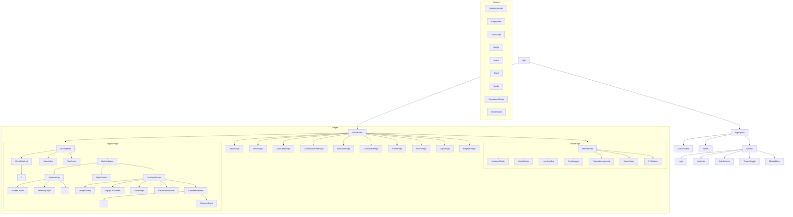

---

# 11. VUE COMPONENT STRUCTURE

```
src/
├── App.vue
├── main.ts
├── router/
│   └── index.ts
├── stores/
│   ├── auth.store.ts
│   ├── deals.store.ts
│   ├── map.store.ts
│   ├── feed.store.ts
│   ├── reservation.store.ts
│   ├── analytics.store.ts
│   ├── ai.store.ts
│   ├── ui.store.ts
│   └── notifications.store.ts
├── composables/
│   ├── useSocket.ts
│   ├── useGeolocation.ts
│   ├── useInfiniteScroll.ts
│   ├── useCountdown.ts
│   ├── useOptimisticReservation.ts
│   ├── useDebounce.ts
│   ├── useDarkMode.ts
│   ├── useMediaQuery.ts
│   ├── useIntersectionObserver.ts
│   └── usePageMeta.ts
├── services/
│   ├── api/
│   │   ├── axios.ts
│   │   ├── deals.service.ts
│   │   ├── auth.service.ts
│   │   ├── news.service.ts
│   │   ├── ai.service.ts
│   │   ├── analytics.service.ts
│   │   └── admin.service.ts
│   ├── socket/
│   │   ├── socket.ts
│   │   ├── deal.socket.ts
│   │   ├── feed.socket.ts
│   │   ├── reservation.socket.ts
│   │   └── analytics.socket.ts
│   └── ai/
│       └── imageSearch.ts
├── components/
│   ├── common/
│   │   ├── AppNavBar.vue
│   │   ├── AppFooter.vue
│   │   ├── AppMobileNav.vue
│   │   ├── SkeletonLoader.vue
│   │   ├── EmptyState.vue
│   │   ├── ErrorState.vue
│   │   ├── Badge.vue
│   │   ├── Avatar.vue
│   │   ├── Toast.vue
│   │   ├── Modal.vue
│   │   ├── CountdownTimer.vue
│   │   ├── InfiniteScroll.vue
│   │   ├── ThemeToggle.vue
│   │   └── LoadingButton.vue
│   ├── home/
│   │   ├── HeroBanner.vue
│   │   ├── FeaturedDeals.vue
│   │   ├── HowItWorks.vue
│   │   ├── LiveStatsBar.vue
│   │   └── FoodImages.vue
│   ├── map/
│   │   ├── MapContainer.vue
│   │   ├── DealMarker.vue
│   │   ├── MarkerCluster.vue
│   │   ├── HeatmapLayer.vue
│   │   └── MapControls.vue
│   ├── deals/
│   │   ├── DealCard.vue
│   │   ├── DealList.vue
│   │   ├── DealDetailPanel.vue
│   │   ├── DealForm.vue
│   │   ├── DealFilters.vue
│   │   ├── DealSearch.vue
│   │   ├── DealSort.vue
│   │   ├── ImageGallery.vue
│   │   ├── ExpiryCountdown.vue
│   │   └── TrustBadge.vue
│   ├── reservation/
│   │   ├── ReservationButton.vue
│   │   ├── ReservationStatus.vue
│   │   ├── ReservationCountdown.vue
│   │   └── ReservationList.vue
│   ├── comments/
│   │   ├── CommentSection.vue
│   │   ├── CommentItem.vue
│   │   └── CommentForm.vue
│   ├── feed/
│   │   ├── ActivityStream.vue
│   │   ├── ActivityItem.vue
│   │   └── LiveBadge.vue
│   ├── ai/
│   │   ├── AIUploader.vue
│   │   ├── AIResultCard.vue
│   │   └── ConfidenceBadge.vue
│   ├── dashboard/
│   │   ├── LiveEventChart.vue
│   │   ├── StatCard.vue
│   │   ├── ActivityTable.vue
│   │   └── MetricCard.vue
│   └── admin/
│       ├── UserTable.vue
│       ├── DealModeration.vue
│       └── SystemSettings.vue
├── views/
│   ├── HomeView.vue
│   ├── AboutView.vue
│   ├── NewsView.vue
│   ├── NewsDetailView.vue
│   ├── ExploreView.vue
│   ├── DealDetailView.vue
│   ├── CommunityFeedView.vue
│   ├── AISearchView.vue
│   ├── DashboardView.vue
│   ├── ProfileView.vue
│   ├── AdminView.vue
│   ├── LoginView.vue
│   └── RegisterView.vue
├── layouts/
│   ├── DefaultLayout.vue
│   ├── AuthLayout.vue
│   └── AdminLayout.vue
├── utils/
│   ├── formatters.ts
│   ├── validators.ts
│   ├── geo.ts
│   └── constants.ts
├── types/
│   ├── deal.types.ts
│   ├── user.types.ts
│   ├── news.types.ts
│   ├── analytics.types.ts
│   ├── socket.types.ts
│   └── map.types.ts
├── assets/
│   ├── images/
│   ├── icons/
│   └── styles/
│       ├── variables.css
│       ├── animations.css
│       ├── typography.css
│       └── main.css
└── __tests__/
    ├── components/
    ├── stores/
    ├── composables/
    └── services/
```

---

# 12. DATABASE SCHEMA

## Entity Relationship Diagram

```mermaid
erDiagram
    users {
        uuid id PK
        string email UK
        string username UK
        string password_hash
        string first_name
        string last_name
        enum role "guest|user|moderator|admin"
        float trust_score
        int reputation_points
        string avatar_url
        boolean is_active
        timestamp created_at
        timestamp updated_at
        timestamp last_login
    }
    
    deals {
        uuid id PK
        uuid user_id FK
        uuid store_id FK
        string title
        text description
        decimal original_price
        decimal discount_price
        string currency
        int remaining_quantity
        int original_quantity
        enum status "active|reserved|expired|removed"
        boolean verified
        uuid verified_by FK
        point location "PostGIS geography"
        string address
        float latitude
        float longitude
        jsonb images "array of image URLs"
        timestamp expires_at
        jsonb tags "array of category tags"
        int version "optimistic locking"
        int like_count
        int bookmark_count
        int comment_count
        timestamp created_at
        timestamp updated_at
    }
    
    stores {
        uuid id PK
        string name
        string address
        point location
        float latitude
        float longitude
        string category
        float avg_trust_score
        int total_deals
        boolean is_active
        timestamp created_at
        timestamp updated_at
    }
    
    reservations {
        uuid id PK
        uuid deal_id FK
        uuid user_id FK
        enum status "active|confirmed|cancelled|expired"
        timestamp reserved_at
        timestamp expires_at "15 minutes from reserved_at"
        timestamp confirmed_at
        string reservation_code
        int quantity_reserved
    }
    
    comments {
        uuid id PK
        uuid deal_id FK
        uuid user_id FK
        uuid parent_id FK "for replies"
        text content
        int like_count
        enum status "active|hidden|flagged"
        timestamp created_at
        timestamp updated_at
    }
    
    likes {
        uuid id PK
        uuid user_id FK
        uuid target_id FK "deal or comment"
        string target_type "deal|comment"
        enum type "like|upvote"
        timestamp created_at
        UK user_id + target_id + target_type
    }
    
    bookmarks {
        uuid id PK
        uuid user_id FK
        uuid deal_id FK
        timestamp created_at
        UK user_id + deal_id
    }
    
    verification_events {
        uuid id PK
        uuid deal_id FK
        uuid moderator_id FK
        enum action "verified|rejected|flagged"
        text notes
        timestamp created_at
    }
    
    activity_events {
        uuid id PK
        uuid user_id FK
        uuid deal_id FK
        enum event_type "deal_created|deal_verified|reservation_made|comment_added|deal_expired"
        jsonb metadata
        timestamp created_at
    }
    
    analytics_snapshots {
        uuid id PK
        int active_users
        int reservations_per_minute
        int deals_per_minute
        int verifications_total
        int comments_total
        timestamp captured_at
    }
    
    news_articles {
        uuid id PK
        string title
        text content
        string category
        string image_url
        date published_date
        enum status "published|draft"
        timestamp created_at
        timestamp updated_at
    }

    users ||--o{ deals : "creates"
    users ||--o{ reservations : "makes"
    users ||--o{ comments : "writes"
    users ||--o{ likes : "gives"
    users ||--o{ bookmarks : "saves"
    users ||--o{ verification_events : "performs"
    users ||--o{ activity_events : "generates"
    deals ||--o{ reservations : "has"
    deals ||--o{ comments : "has"
    deals ||--o{ likes : "receives"
    deals ||--o{ bookmarks : "receives"
    deals ||--o{ verification_events : "undergoes"
    deals ||--o{ activity_events : "triggers"
    deals }o--|| stores : "belongs_to"
    stores ||--o{ deals : "lists"
    comments ||--o{ comments : "replies"
```

## Table Definitions

### users

| Column | Type | Constraints | Description |
|---|---|---|---|
| id | UUID | PK, DEFAULT gen_random_uuid() | Primary key |
| email | VARCHAR(255) | UNIQUE, NOT NULL | User email |
| username | VARCHAR(100) | UNIQUE, NOT NULL | Display username |
| password_hash | VARCHAR(255) | NOT NULL | bcrypt hash |
| first_name | VARCHAR(100) | | First name |
| last_name | VARCHAR(100) | | Last name |
| role | ENUM | 'user' DEFAULT | guest, user, moderator, admin |
| trust_score | DECIMAL(3,2) | 0.00 DEFAULT | 0.00–5.00 |
| reputation_points | INT | 0 DEFAULT | Accumulated points |
| avatar_url | TEXT | | Avatar image URL |
| is_active | BOOLEAN | true DEFAULT | Soft delete flag |
| created_at | TIMESTAMPTZ | DEFAULT NOW() | |
| updated_at | TIMESTAMPTZ | DEFAULT NOW() | |
| last_login | TIMESTAMPTZ | | |

### deals

| Column | Type | Constraints | Description |
|---|---|---|---|
| id | UUID | PK | Primary key |
| user_id | UUID | FK → users, NOT NULL | Creator |
| store_id | UUID | FK → stores | Store reference |
| title | VARCHAR(200) | NOT NULL | Deal title |
| description | TEXT | | Full description |
| original_price | DECIMAL(10,2) | NOT NULL | Original price |
| discount_price | DECIMAL(10,2) | NOT NULL | Discounted price |
| currency | VARCHAR(3) | 'AUD' DEFAULT | Currency code |
| remaining_quantity | INT | NOT NULL, >= 0 | Available stock |
| original_quantity | INT | NOT NULL | Starting stock |
| status | ENUM | 'active' DEFAULT | active, reserved, expired, removed |
| verified | BOOLEAN | false DEFAULT | Verified by moderator |
| verified_by | UUID | FK → users | Moderator who verified |
| location | GEOGRAPHY(POINT) | | PostGIS spatial index |
| latitude | DECIMAL(10,7) | NOT NULL | For non-PostGIS queries |
| longitude | DECIMAL(10,7) | NOT NULL | |
| images | JSONB | '[]' DEFAULT | Array of image URLs |
| expires_at | TIMESTAMPTZ | NOT NULL | Deal expiry |
| tags | JSONB | '[]' DEFAULT | Category tags |
| version | INT | 1 DEFAULT | Optimistic locking |
| like_count | INT | 0 DEFAULT | Denormalised count |
| bookmark_count | INT | 0 DEFAULT | Denormalised count |
| comment_count | INT | 0 DEFAULT | Denormalised count |
| created_at | TIMESTAMPTZ | DEFAULT NOW() | |
| updated_at | TIMESTAMPTZ | DEFAULT NOW() | |

**Indexes:**
- `idx_deals_location` — GIST on `location` (PostGIS)
- `idx_deals_status` — on `status`
- `idx_deals_expires_at` — on `expires_at`
- `idx_deals_tags` — GIN on `tags` (JSONB)
- `idx_deals_created_at` — on `created_at DESC`

### reservations

| Column | Type | Constraints | Description |
|---|---|---|---|
| id | UUID | PK | |
| deal_id | UUID | FK → deals, NOT NULL | |
| user_id | UUID | FK → users, NOT NULL | |
| status | ENUM | 'active' DEFAULT | active, confirmed, cancelled, expired |
| reserved_at | TIMESTAMPTZ | DEFAULT NOW() | |
| expires_at | TIMESTAMPTZ | NOT NULL | reserved_at + 15min |
| confirmed_at | TIMESTAMPTZ | | |
| reservation_code | VARCHAR(20) | UNIQUE | Short code for pickup |
| quantity_reserved | INT | 1 DEFAULT | |

**Indexes:**
- `idx_reservations_deal_status` — on `(deal_id, status)`
- `idx_reservations_expires_at` — on `expires_at` (for expiry workers)

---

# 13. ERD (Extended)

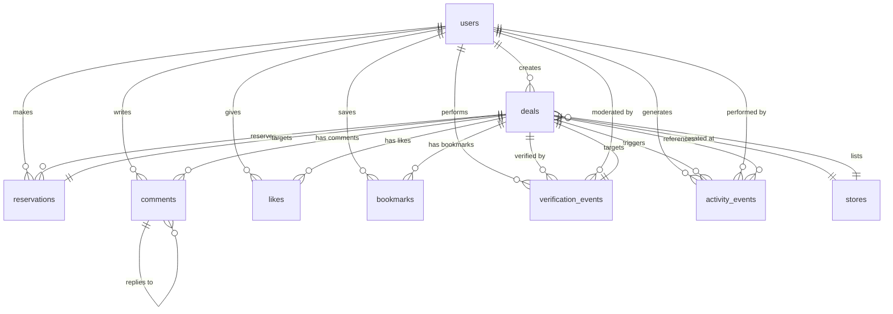

---

# 14. API DESIGN

## RESTful API Endpoints

### Authentication

| Method | Endpoint | Auth | Description |
|---|---|---|---|
| POST | `/api/auth/register` | No | Register new user |
| POST | `/api/auth/login` | No | Login, returns JWT |
| POST | `/api/auth/logout` | Yes | Invalidate token |
| GET | `/api/auth/me` | Yes | Current user profile |
| PUT | `/api/auth/me` | Yes | Update profile |
| POST | `/api/auth/refresh` | Yes | Refresh JWT token |

### Deals

| Method | Endpoint | Auth | Role | Description |
|---|---|---|---|---|
| GET | `/api/deals` | No | All | List deals (paginated, searchable, filterable) |
| GET | `/api/deals/:id` | No | All | Single deal detail |
| POST | `/api/deals` | Yes | user+ | Create deal |
| PUT | `/api/deals/:id` | Yes | owner/moderator+ | Update deal |
| DELETE | `/api/deals/:id` | Yes | owner/admin | Delete deal |
| GET | `/api/deals/map` | No | All | Deals within bounds (viewport query) |
| POST | `/api/deals/:id/verify` | Yes | moderator+ | Verify deal |
| POST | `/api/deals/:id/like` | Yes | user+ | Toggle like |
| POST | `/api/deals/:id/bookmark` | Yes | user+ | Toggle bookmark |

### Reservations

| Method | Endpoint | Auth | Description |
|---|---|---|---|
| POST | `/api/deals/:id/reserve` | Yes | Create reservation (optimistic lock) |
| GET | `/api/reservations` | Yes | My reservations |
| PUT | `/api/reservations/:id/confirm` | Yes | Confirm pickup |
| DELETE | `/api/reservations/:id` | Yes | Cancel reservation |
| GET | `/api/reservations/:id/status` | Yes | Check status |

### Comments

| Method | Endpoint | Auth | Description |
|---|---|---|---|
| GET | `/api/deals/:id/comments` | No | List comments |
| POST | `/api/deals/:id/comments` | Yes | Create comment |
| PUT | `/api/comments/:id` | Yes | Edit comment (owner only) |
| DELETE | `/api/comments/:id` | Yes | Delete comment (owner/mod) |
| POST | `/api/comments/:id/like` | Yes | Toggle like |

### Stores

| Method | Endpoint | Auth | Description |
|---|---|---|---|
| GET | `/api/stores` | No | List stores |
| GET | `/api/stores/:id` | No | Store details |
| POST | `/api/stores` | Yes | Create store |
| PUT | `/api/stores/:id` | Yes | Update store |

### AI Search

| Method | Endpoint | Auth | Description |
|---|---|---|---|
| POST | `/api/ai/search` | Yes | Upload image, get matching deals |
| GET | `/api/ai/categories` | No | Available food categories |

### Analytics

| Method | Endpoint | Auth | Role | Description |
|---|---|---|---|---|
| GET | `/api/analytics/live` | Yes | admin | Current live metrics |
| GET | `/api/analytics/deals` | Yes | admin | Deal statistics |
| GET | `/api/analytics/users` | Yes | admin | User statistics |

### Admin

| Method | Endpoint | Auth | Role | Description |
|---|---|---|---|---|
| GET | `/api/admin/users` | Yes | admin | List all users |
| PUT | `/api/admin/users/:id/role` | Yes | admin | Change user role |
| PUT | `/api/admin/users/:id/ban` | Yes | admin | Ban user |
| GET | `/api/admin/deals` | Yes | admin | List all deals |
| DELETE | `/api/admin/deals/:id` | Yes | admin | Force delete deal |

### News

| Method | Endpoint | Auth | Description |
|---|---|---|---|
| GET | `/api/news` | No | List articles (paginated) |
| GET | `/api/news/:id` | No | Single article |
| GET | `/api/news/categories` | No | List categories |

## Query Parameters

### GET /api/deals

```
?page=1
&limit=20
&search=sandwich
&category=fresh_food,dairy
&sort=created_at
&order=desc
&lat=-37.8136
&lng=144.9631
&radius=5000
&status=active
&verified=true
```

### GET /api/deals/map (Viewport Query)

```
?sw_lat=-37.82
&sw_lng=144.95
&ne_lat=-37.80
&ne_lng=144.98
&zoom=15
&categories=fresh_food
&status=active
```

---

# 15. WEBSOCKET ARCHITECTURE

## Socket.IO Event Map

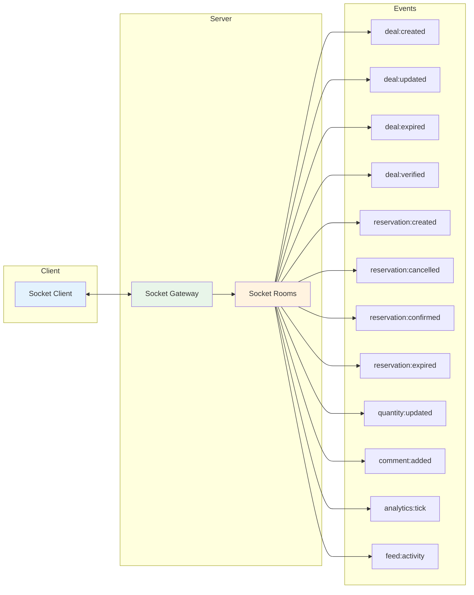

## Socket Event Specifications

### Client → Server

| Event | Payload | Description |
|---|---|---|
| `deal:join` | `{ dealId: string }` | Join deal-specific room |
| `deal:leave` | `{ dealId: string }` | Leave deal room |
| `map:viewport` | `{ bounds, zoom }` | Register viewport interest |
| `map:leave` | `{}` | Leave map viewport updates |
| `feed:join` | `{}` | Join community feed room |
| `feed:leave` | `{}` | Leave community feed |
| `dashboard:join` | `{}` | Join analytics dashboard room |
| `dashboard:leave` | `{}` | Leave dashboard room |

### Server → Client

| Event | Payload | Description |
|---|---|---|
| `deal:created` | `Deal` | New deal in viewport/feed |
| `deal:updated` | `{ id, changes }` | Deal updated (quantity, etc.) |
| `deal:expired` | `{ id }` | Deal has expired |
| `deal:verified` | `{ id, verifiedBy }` | Deal verified by moderator |
| `deal:quantity` | `{ id, remaining }` | Live quantity update |
| `reservation:created` | `{ reservation }` | Reservation made (to deal room) |
| `reservation:cancelled` | `{ id, dealId }` | Reservation cancelled |
| `reservation:confirmed` | `{ id, dealId }` | Pickup confirmed |
| `reservation:expired` | `{ id, dealId }` | Hold expired, qty restored |
| `comment:added` | `Comment` | New comment on deal |
| `analytics:tick` | `AnalyticsSnapshot` | Periodic stats update (5s) |
| `feed:activity` | `ActivityEvent` | New activity in community |
| `user:presence` | `{ userId, status }` | User online/offline |

## Room Architecture

| Room | Who Joins | Events |
|---|---|---|
| `deal:{dealId}` | Users viewing that deal | reservation:created, comment:added, quantity:updated |
| `map:{boundsHash}` | Users with map viewport | deal:created, deal:updated, deal:expired |
| `feed:global` | Community feed page | feed:activity, deal:created |
| `dashboard:admin` | Admin users only | analytics:tick, user:presence |
| `user:{userId}` | Individual user | reservation:expired, reservation:confirmed |
| `location:{geohash}` | Users in region | deal:created (within region) |

---

# 16. STATE MANAGEMENT DESIGN

## Pinia Store Architecture

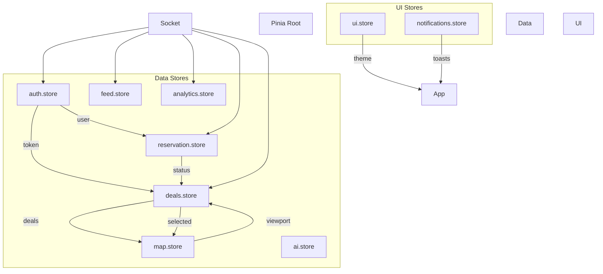

## Store Definitions

### auth.store.ts

```typescript
interface AuthState {
  user: User | null;
  token: string | null;
  isAuthenticated: boolean;
  isLoading: boolean;
  error: string | null;
}

// Actions: login, register, logout, fetchMe, updateProfile
// Getters: isLoggedIn, isModerator, isAdmin, displayName
```

### deals.store.ts

```typescript
interface DealsState {
  deals: Deal[];
  selectedDeal: Deal | null;
  filters: DealFilters;
  sort: DealSort;
  pagination: Pagination;
  isLoading: boolean;
  isSubmitting: boolean;
  error: string | null;
}

// Actions: fetchDeals, fetchMapDeals, createDeal, updateDeal,
//          deleteDeal, toggleLike, toggleBookmark, setFilters,
//          handleSocketUpdate
// Getters: filteredDeals, myDeals, activeDeals, dealsByBounds
```

### map.store.ts

```typescript
interface MapState {
  mapInstance: mapboxgl.Map | null;
  viewport: Viewport;
  markers: DealMarker[];
  clusters: Cluster[];
  heatmapEnabled: boolean;
  clusteringEnabled: boolean;
  selectedMarkerId: string | null;
  isLoading: boolean;
}

// Actions: initMap, updateViewport, addMarker, removeMarker,
//          toggleHeatmap, toggleClustering, flyToDeal,
//          handleViewportChange
// Getters: visibleMarkers, markerClusters, heatmapData
```

### reservation.store.ts

```typescript
interface ReservationState {
  reservations: Reservation[];
  activeReservation: Reservation | null;
  isReserving: boolean;
  countdown: number | null;
  error: string | null;
}

// Actions: reserveDeal, confirmReservation, cancelReservation,
//          handleSocketUpdate, startCountdown, expireReservation
// Getters: activeReservations, expiredReservations, canReserve
```

### feed.store.ts

```typescript
interface FeedState {
  activities: ActivityEvent[];
  isConnected: boolean;
  unreadCount: number;
}

// Actions: connectFeed, handleNewActivity, markAsRead
// Getters: recentActivities, hasUnread
```

### analytics.store.ts

```typescript
interface AnalyticsState {
  liveMetrics: LiveMetrics | null;
  history: AnalyticsSnapshot[];
  isConnected: boolean;
}

// Actions: connectDashboard, handleAnalyticsTick, fetchHistory
// Getters: currentMetrics, metricsHistory
```

### ui.store.ts

```typescript
interface UIState {
  theme: 'light' | 'dark';
  sidebarOpen: boolean;
  mobileNavOpen: boolean;
  activeModal: string | null;
  screenSize: 'mobile' | 'tablet' | 'desktop';
}
```

### notifications.store.ts

```typescript
interface NotificationsState {
  toasts: Toast[];
}

// Actions: show, success, error, dismiss
```

---

# 17. CONCURRENCY DESIGN

## Reservation Optimistic Locking Flow

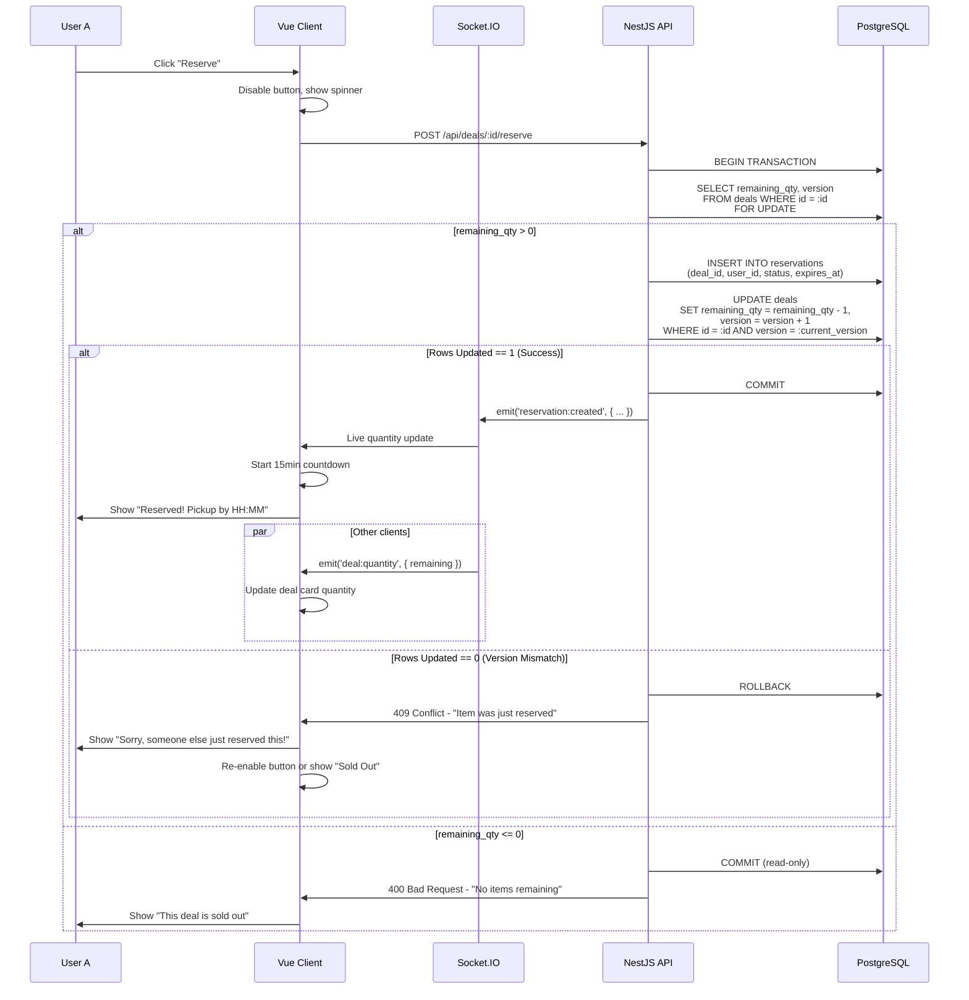

## Reservation Expiry Flow

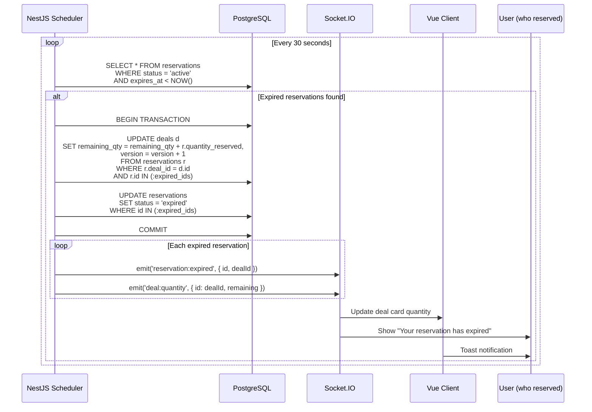

## Concurrency Challenges & Solutions

| Challenge | Solution | Implementation |
|---|---|---|
| Race condition on reserve | Optimistic locking with version column | `UPDATE deals SET ... WHERE id = X AND version = V` |
| Reservation timeout | Server-side scheduler + client countdown | NestJS @Cron, socket notification |
| Overselling | Transaction with row-level lock | `SELECT ... FOR UPDATE` within transaction |
| Quantity desync | Real-time socket broadcast | `emit('deal:quantity')` to room |
| Multiple tabs | Shared reservation state via store | Poll server on tab focus |
| Network failure mid-reservation | Idempotency key | `idempotency_key` column in reservations |

---

# 18. HIGH VOLUME EVENT DESIGN

## Live Event Dashboard Architecture

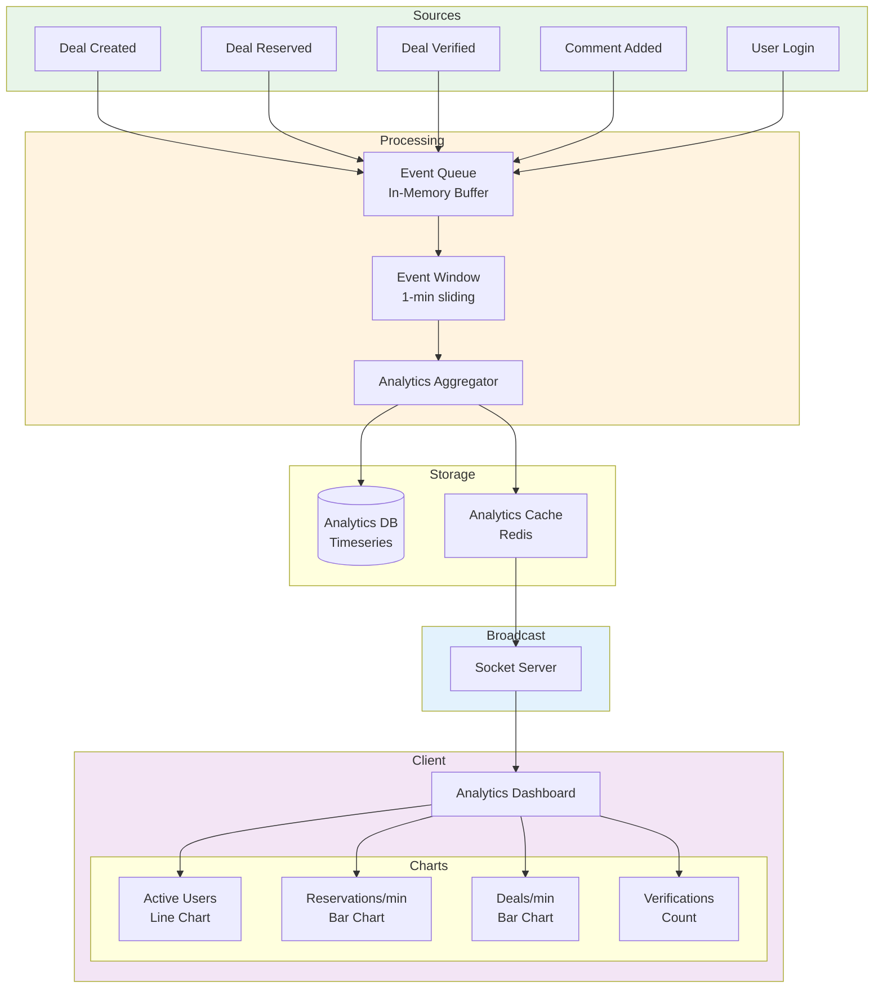

## Event Processing Pipeline

```typescript
// Server-side analytics aggregator (NestJS)
@Injectable()
export class AnalyticsService {
  private eventBuffer: Event[] = [];
  private readonly windowSizeMs = 60_000; // 1-minute sliding window
  private readonly flushIntervalMs = 5_000; // Emit every 5 seconds
  
  // Metrics computed every 5s
  private metrics: LiveMetrics = {
    activeUsers: 0,
    reservationsPerMinute: 0,
    dealsPerMinute: 0,
    verificationsTotal: 0,
    commentsTotal: 0,
    timestamp: new Date(),
  };

  @Cron(CronExpression.EVERY_5_SECONDS)
  computeMetrics(): void {
    const now = Date.now();
    const windowStart = now - this.windowSizeMs;
    
    // Slide window: remove events older than 1 minute
    this.eventBuffer = this.eventBuffer.filter(e => e.timestamp > windowStart);
    
    // Compute rolling metrics
    this.metrics = {
      activeUsers: this.countUniqueUsers(this.eventBuffer),
      reservationsPerMinute: this.countByType(this.eventBuffer, 'reservation_made'),
      dealsPerMinute: this.countByType(this.eventBuffer, 'deal_created'),
      verificationsTotal: this.countByType(this.eventBuffer, 'deal_verified'),
      commentsTotal: this.countByType(this.eventBuffer, 'comment_added'),
      timestamp: new Date(),
    };
    
    // Broadcast to admin dashboard room
    this.socketServer.to('dashboard:admin').emit('analytics:tick', this.metrics);
    
    // Persist snapshot
    this.analyticsRepository.save({
      ...this.metrics,
      capturedAt: this.metrics.timestamp,
    });
  }
}
```

## Client-Side Chart Rendering

```typescript
// Dashboard component with live-updating Chart.js
const chartData = ref<ChartData>({
  labels: [], // timestamps
  datasets: [{
    label: 'Reservations/min',
    data: [],
    borderColor: '#10b981',
    backgroundColor: 'rgba(16, 185, 129, 0.1)',
    tension: 0.4,
    fill: true,
  }],
});

onMounted(() => {
  socket.on('analytics:tick', (metrics: LiveMetrics) => {
    // Keep last 20 data points
    chartData.value.labels.push(formatTime(metrics.timestamp));
    chartData.value.datasets[0].data.push(metrics.reservationsPerMinute);
    
    if (chartData.value.labels.length > 20) {
      chartData.value.labels.shift();
      chartData.value.datasets[0].data.shift();
    }
    
    // Animate chart update
    chartRef.value?.update('none'); // 'none' for performance
  });
});
```

## Performance Considerations

| Concern | Solution |
|---|---|
| Too many events | Buffer and batch-process every 5s |
| Chart re-render on every tick | Use `update('none')` — skip animation |
| Memory leak with unbounded history | Keep last 20 data points only |
| Large dashboards | Virtual scrolling for event tables |
| Multiple admin clients | Single server process, broadcast once |

---

# 19. SECURITY DESIGN

## Authentication & Authorization

```
┌──────────────────────────────────────────────────┐
│                   Security Layers                │
├──────────────────────────────────────────────────┤
│  1. Transport Security                           │
│     - HTTPS everywhere                           │
│     - WSS for WebSocket                          │
│     - HSTS headers                               │
├──────────────────────────────────────────────────┤
│  2. Authentication                               │
│     - JWT (access + refresh tokens)              │
│     - Access: 15min expiry                       │
│     - Refresh: 7 day expiry (httpOnly cookie)    │
│     - bcrypt password hashing (cost 12)          │
│     - Rate limiting on login (5/min per IP)      │
├──────────────────────────────────────────────────┤
│  3. Authorization (RBAC)                         │
│     - Role-based guards on routes                │
│     - Route meta: { requiresAuth: true, role: }  │
│     - Backend @Roles('admin') decorator          │
│     - Socket room access validation              │
├──────────────────────────────────────────────────┤
│  4. Input Validation                             │
│     - Zod schemas on all API inputs              │
│     - XSS prevention (DOMPurify on content)      │
│     - SQL injection prevention (parameterized)   │
│     - File upload validation (type, size, scan)  │
├──────────────────────────────────────────────────┤
│  5. CSRF Protection                              │
│     - SameSite=Strict cookies                    │
│     - CSRF tokens for non-GET requests           │
├──────────────────────────────────────────────────┤
│  6. Rate Limiting                                │
│     - API: 100 req/min per user                  │
│     - Auth: 5 req/min per IP                     │
│     - Create deal: 10 req/hour per user          │
│     - Reserve: 20 req/hour per user              │
├──────────────────────────────────────────────────┤
│  7. Data Protection                              │
│     - Input sanitisation                         │
│     - No sensitive data in JWTs                  │
│     - Soft delete for users/deals                │
│     - Audit logging for admin actions            │
└──────────────────────────────────────────────────┘
```

## Vue Router Route Guards

```typescript
// router/index.ts
const routes: RouteRecordRaw[] = [
  {
    path: '/admin',
    meta: { requiresAuth: true, role: 'admin' },
    component: AdminView,
  },
  {
    path: '/explore',
    meta: { requiresAuth: false },
    component: ExploreView,
  },
  {
    path: '/profile',
    meta: { requiresAuth: true },
    component: ProfileView,
  },
];

router.beforeEach((to, from, next) => {
  const authStore = useAuthStore();
  
  if (to.meta.requiresAuth && !authStore.isAuthenticated) {
    next({ path: '/login', query: { redirect: to.fullPath } });
    return;
  }
  
  if (to.meta.role && authStore.user?.role !== to.meta.role) {
    next({ path: '/', query: { error: 'unauthorized' } });
    return;
  }
  
  next();
});
```

## Socket Authentication

```typescript
// Socket middleware
socket.use(([event, ...args], next) => {
  const token = socket.handshake.auth.token;
  
  if (!token) {
    return next(new Error('Authentication required'));
  }
  
  try {
    const decoded = jwt.verify(token, process.env.JWT_SECRET);
    socket.data.user = decoded;
    next();
  } catch (err) {
    next(new Error('Invalid token'));
  }
});
```

---

# 20. ACCESSIBILITY DESIGN

## WCAG 2.1 AA Compliance

| Principle | Guideline | Implementation |
|---|---|---|
| **Perceivable** | 1.1.1 Non-text Content | All images have alt text; decorative images use `aria-hidden` |
| | 1.4.3 Contrast (Minimum) | 4.5:1 ratio for normal text; 3:1 for large text |
| | 1.4.12 Text Spacing | No loss of content when text spacing is overridden |
| **Operable** | 2.1.1 Keyboard | All interactive elements reachable via Tab/Shift+Tab |
| | 2.1.2 No Keyboard Trap | No focus traps; Escape dismisses modals/panels |
| | 2.4.3 Focus Order | Logical tab order matching visual layout |
| | 2.4.7 Focus Visible | Custom focus ring (3px outline) on all interactive elements |
| | 2.5.3 Label in Name | Buttons with visible labels have matching accessible names |
| **Understandable** | 3.2.1 On Focus | No unexpected context changes on focus |
| | 3.3.1 Error Identification | Form errors shown inline with field |
| | 3.3.2 Labels/Instructions | All form fields have visible labels |
| **Robust** | 4.1.2 Name, Role, Value | ARIA landmarks, roles, and states correctly applied |
| | 4.1.3 Status Messages | Live regions for toast notifications |

## Accessibility Implementation Details

```vue
<!-- Example: ReservationButton with full accessibility -->
<template>
  <button
    :disabled="isSoldOut || isReserving"
    :aria-label="`Reserve ${deal.title}`"
    :aria-busy="isReserving"
    :aria-disabled="isSoldOut"
    class="reservation-button"
    @click="handleReserve"
  >
    <!-- Skeleton shown during loading -->
    <template v-if="isReserving">
      <span class="sr-only">Reserving...</span>
      <span class="spinner" aria-hidden="true"></span>
    </template>
    
    <template v-else-if="isSoldOut">
      <Icon name="sold-out" aria-hidden="true" />
      Sold Out
    </template>
    
    <template v-else>
      <Icon name="cart" aria-hidden="true" />
      Reserve — 15 min hold
    </template>
  </button>
</template>
```

## Colour Accessibility

```css
/* Theme tokens with WCAG AA contrast */
:root {
  /* Light mode */
  --color-bg-primary: #ffffff;
  --color-text-primary: #1a1a2e; /* contrast 15.3:1 */
  --color-text-secondary: #4a4a6a; /* contrast 8.1:1 */
  --color-accent: #2563eb; /* blue-600 */
  --color-success: #059669; /* emerald-600 */
  --color-error: #dc2626; /* red-600 */
  --color-warning: #d97706; /* amber-600 */
}

[data-theme="dark"] {
  --color-bg-primary: #0f0f23;
  --color-text-primary: #e2e8f0; /* contrast 13.5:1 */
  --color-text-secondary: #94a3b8; /* contrast 7.2:1 */
  --color-accent: #60a5fa; /* blue-400 */
  --color-success: #34d399;
  --color-error: #f87171;
  --color-warning: #fbbf24;
}
```

## Screen Reader Support

| Element | ARIA |
|---|---|
| Navigation | `role="navigation"`, `aria-label="Main navigation"` |
| Map | `role="application"`, `aria-label="Deal map"` |
| Deal list | `role="list"`, `aria-live="polite"` for updates |
| Live feed | `aria-live="polite"`, `aria-atomic="false"` |
| Toast notifications | `role="alert"`, `aria-live="assertive"` |
| Modal/panel | `role="dialog"`, `aria-modal="true"` |
| Progress/loading | `aria-busy="true"`, `role="progressbar"` |
| Countdown timer | `aria-live="polite"` with remaining time text |

---

# 21. DEPLOYMENT ARCHITECTURE

## Infrastructure Diagram

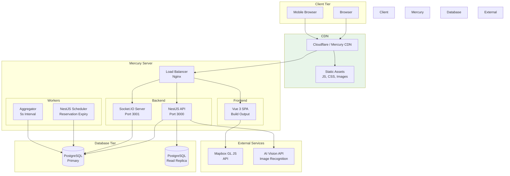

## Deployment Configuration

| Component | Technology | Scaling |
|---|---|---|
| Frontend | Vue 3 SPA (static build) | CDN cached, no server rendering |
| Backend API | NestJS (Node.js) | Horizontal (multi-process) |
| WebSocket | Socket.IO (NestJS Gateway) | Single process with Redis adapter |
| Database | PostgreSQL 15 + PostGIS | Primary + read replica |
| Scheduler | NestJS Cron | Runs on primary backend |
| CDN | Mercury compatible | Static assets |

## Mercury Server Compatibility

```
mercury.yml
---
version: 1
name: dealmap-ai
services:
  - name: frontend
    type: static
    build: npm run build
    output: dist
    routes:
      - "/* -> /index.html"  # SPA fallback
    
  - name: api
    type: node
    build: npm run build
    start: node dist/main
    port: 3000
    memory: 512MB
    
  - name: socket
    type: node
    build: npm run build
    start: node dist/socket
    port: 3001
    memory: 256MB

databases:
  - name: dealmap-db
    type: postgres
    version: 15
    extensions:
      - postgis
```

---

# 22. FOLDER STRUCTURE

```
dealmap-ai/
│
├── client/                          # Vue 3 Frontend
│   ├── public/
│   │   ├── favicon.ico
│   │   └── manifest.json
│   │
│   ├── src/
│   │   ├── App.vue
│   │   ├── main.ts
│   │   │
│   │   ├── router/
│   │   │   └── index.ts
│   │   │
│   │   ├── stores/
│   │   │   ├── auth.store.ts
│   │   │   ├── deals.store.ts
│   │   │   ├── map.store.ts
│   │   │   ├── feed.store.ts
│   │   │   ├── reservation.store.ts
│   │   │   ├── analytics.store.ts
│   │   │   ├── ai.store.ts
│   │   │   ├── ui.store.ts
│   │   │   └── notifications.store.ts
│   │   │
│   │   ├── composables/
│   │   │   ├── useSocket.ts
│   │   │   ├── useGeolocation.ts
│   │   │   ├── useInfiniteScroll.ts
│   │   │   ├── useCountdown.ts
│   │   │   ├── useOptimisticReservation.ts
│   │   │   ├── useDebounce.ts
│   │   │   ├── useDarkMode.ts
│   │   │   ├── useMediaQuery.ts
│   │   │   ├── useIntersectionObserver.ts
│   │   │   └── usePageMeta.ts
│   │   │
│   │   ├── services/
│   │   │   ├── api/
│   │   │   │   ├── axios.ts
│   │   │   │   ├── deals.service.ts
│   │   │   │   ├── auth.service.ts
│   │   │   │   ├── news.service.ts
│   │   │   │   ├── ai.service.ts
│   │   │   │   ├── analytics.service.ts
│   │   │   │   └── admin.service.ts
│   │   │   └── socket/
│   │   │       ├── socket.ts
│   │   │       ├── deal.socket.ts
│   │   │       ├── feed.socket.ts
│   │   │       ├── reservation.socket.ts
│   │   │       └── analytics.socket.ts
│   │   │
│   │   ├── components/
│   │   │   ├── common/
│   │   │   │   ├── AppNavBar.vue
│   │   │   │   ├── AppFooter.vue
│   │   │   │   ├── AppMobileNav.vue
│   │   │   │   ├── SkeletonLoader.vue
│   │   │   │   ├── EmptyState.vue
│   │   │   │   ├── ErrorState.vue
│   │   │   │   ├── Badge.vue
│   │   │   │   ├── Avatar.vue
│   │   │   │   ├── Toast.vue
│   │   │   │   ├── Modal.vue
│   │   │   │   ├── CountdownTimer.vue
│   │   │   │   ├── InfiniteScroll.vue
│   │   │   │   ├── ThemeToggle.vue
│   │   │   │   └── LoadingButton.vue
│   │   │   │
│   │   │   ├── home/
│   │   │   │   ├── HeroBanner.vue
│   │   │   │   ├── FeaturedDeals.vue
│   │   │   │   ├── HowItWorks.vue
│   │   │   │   ├── LiveStatsBar.vue
│   │   │   │   └── FoodImages.vue
│   │   │   │
│   │   │   ├── map/
│   │   │   │   ├── MapContainer.vue
│   │   │   │   ├── DealMarker.vue
│   │   │   │   ├── MarkerCluster.vue
│   │   │   │   ├── HeatmapLayer.vue
│   │   │   │   └── MapControls.vue
│   │   │   │
│   │   │   ├── deals/
│   │   │   │   ├── DealCard.vue
│   │   │   │   ├── DealList.vue
│   │   │   │   ├── DealDetailPanel.vue
│   │   │   │   ├── DealForm.vue
│   │   │   │   ├── DealFilters.vue
│   │   │   │   ├── DealSearch.vue
│   │   │   │   ├── DealSort.vue
│   │   │   │   ├── ImageGallery.vue
│   │   │   │   ├── ExpiryCountdown.vue
│   │   │   │   └── TrustBadge.vue
│   │   │   │
│   │   │   ├── reservation/
│   │   │   │   ├── ReservationButton.vue
│   │   │   │   ├── ReservationStatus.vue
│   │   │   │   ├── ReservationCountdown.vue
│   │   │   │   └── ReservationList.vue
│   │   │   │
│   │   │   ├── comments/
│   │   │   │   ├── CommentSection.vue
│   │   │   │   ├── CommentItem.vue
│   │   │   │   └── CommentForm.vue
│   │   │   │
│   │   │   ├── feed/
│   │   │   │   ├── ActivityStream.vue
│   │   │   │   ├── ActivityItem.vue
│   │   │   │   └── LiveBadge.vue
│   │   │   │
│   │   │   ├── ai/
│   │   │   │   ├── AIUploader.vue
│   │   │   │   ├── AIResultCard.vue
│   │   │   │   └── ConfidenceBadge.vue
│   │   │   │
│   │   │   ├── dashboard/
│   │   │   │   ├── LiveEventChart.vue
│   │   │   │   ├── StatCard.vue
│   │   │   │   ├── ActivityTable.vue
│   │   │   │   └── MetricCard.vue
│   │   │   │
│   │   │   └── admin/
│   │   │       ├── UserTable.vue
│   │   │       ├── DealModeration.vue
│   │   │       └── SystemSettings.vue
│   │   │
│   │   ├── views/
│   │   │   ├── HomeView.vue
│   │   │   ├── AboutView.vue
│   │   │   ├── NewsView.vue
│   │   │   ├── NewsDetailView.vue
│   │   │   ├── ExploreView.vue
│   │   │   ├── DealDetailView.vue
│   │   │   ├── CommunityFeedView.vue
│   │   │   ├── AISearchView.vue
│   │   │   ├── DashboardView.vue
│   │   │   ├── ProfileView.vue
│   │   │   ├── AdminView.vue
│   │   │   ├── LoginView.vue
│   │   │   └── RegisterView.vue
│   │   │
│   │   ├── layouts/
│   │   │   ├── DefaultLayout.vue
│   │   │   ├── AuthLayout.vue
│   │   │   └── AdminLayout.vue
│   │   │
│   │   ├── utils/
│   │   │   ├── formatters.ts
│   │   │   ├── validators.ts
│   │   │   ├── geo.ts
│   │   │   └── constants.ts
│   │   │
│   │   ├── types/
│   │   │   ├── deal.types.ts
│   │   │   ├── user.types.ts
│   │   │   ├── news.types.ts
│   │   │   ├── analytics.types.ts
│   │   │   ├── socket.types.ts
│   │   │   └── map.types.ts
│   │   │
│   │   └── assets/
│   │       ├── images/
│   │       ├── icons/
│   │       └── styles/
│   │           ├── variables.css
│   │           ├── animations.css
│   │           ├── typography.css
│   │           └── main.css
│   │
│   ├── __tests__/
│   │   ├── components/
│   │   ├── stores/
│   │   ├── composables/
│   │   └── services/
│   │
│   ├── index.html
│   ├── package.json
│   ├── tsconfig.json
│   ├── vite.config.ts
│   └── .env.example
│
├── server/                          # NestJS Backend
│   ├── src/
│   │   ├── main.ts
│   │   ├── app.module.ts
│   │   │
│   │   ├── auth/
│   │   │   ├── auth.module.ts
│   │   │   ├── auth.controller.ts
│   │   │   ├── auth.service.ts
│   │   │   ├── jwt.strategy.ts
│   │   │   ├── jwt-auth.guard.ts
│   │   │   └── dto/
│   │   │       ├── register.dto.ts
│   │   │       ├── login.dto.ts
│   │   │       └── refresh.dto.ts
│   │   │
│   │   ├── users/
│   │   │   ├── users.module.ts
│   │   │   ├── users.controller.ts
│   │   │   ├── users.service.ts
│   │   │   └── entities/
│   │   │       └── user.entity.ts
│   │   │
│   │   ├── deals/
│   │   │   ├── deals.module.ts
│   │   │   ├── deals.controller.ts
│   │   │   ├── deals.service.ts
│   │   │   ├── entities/
│   │   │   │   └── deal.entity.ts
│   │   │   └── dto/
│   │   │       ├── create-deal.dto.ts
│   │   │       ├── update-deal.dto.ts
│   │   │       └── query-deal.dto.ts
│   │   │
│   │   ├── reservations/
│   │   │   ├── reservations.module.ts
│   │   │   ├── reservations.controller.ts
│   │   │   ├── reservations.service.ts
│   │   │   ├── entities/
│   │   │   │   └── reservation.entity.ts
│   │   │   └── dto/
│   │   │       └── create-reservation.dto.ts
│   │   │
│   │   ├── comments/
│   │   │   ├── comments.module.ts
│   │   │   ├── comments.controller.ts
│   │   │   ├── comments.service.ts
│   │   │   └── entities/
│   │   │       └── comment.entity.ts
│   │   │
│   │   ├── stores/
│   │   │   ├── stores.module.ts
│   │   │   ├── stores.controller.ts
│   │   │   ├── stores.service.ts
│   │   │   └── entities/
│   │   │       └── store.entity.ts
│   │   │
│   │   ├── news/
│   │   │   ├── news.module.ts
│   │   │   ├── news.controller.ts
│   │   │   ├── news.service.ts
│   │   │   └── entities/
│   │   │       └── news.entity.ts
│   │   │
│   │   ├── analytics/
│   │   │   ├── analytics.module.ts
│   │   │   ├── analytics.controller.ts
│   │   │   ├── analytics.service.ts
│   │   │   ├── analytics.gateway.ts
│   │   │   └── entities/
│   │   │       └── analytics.entity.ts
│   │   │
│   │   ├── ai/
│   │   │   ├── ai.module.ts
│   │   │   ├── ai.controller.ts
│   │   │   └── ai.service.ts
│   │   │
│   │   ├── socket/
│   │   │   ├── socket.module.ts
│   │   │   ├── socket.gateway.ts
│   │   │   └── socket.adapter.ts
│   │   │
│   │   ├── admin/
│   │   │   ├── admin.module.ts
│   │   │   ├── admin.controller.ts
│   │   │   └── admin.service.ts
│   │   │
│   │   ├── common/
│   │   │   ├── guards/
│   │   │   │   ├── roles.guard.ts
│   │   │   │   └── owner.guard.ts
│   │   │   ├── decorators/
│   │   │   │   ├── roles.decorator.ts
│   │   │   │   └── current-user.decorator.ts
│   │   │   ├── filters/
│   │   │   │   └── http-exception.filter.ts
│   │   │   └── interceptors/
│   │   │       └── transform.interceptor.ts
│   │   │
│   │   └── database/
│   │       ├── database.module.ts
│   │       ├── migrations/
│   │       └── seeds/
│   │           └── seed.ts
│   │
│   ├── test/
│   ├── package.json
│   ├── tsconfig.json
│   ├── nest-cli.json
│   └── .env.example
│
├── docs/
│   ├── wireframes/
│   ├── architecture/
│   └── api/
│
├── mercury.yml
├── README.md
└── .gitignore
```

---

# 23. DEVELOPMENT ROADMAP

## Sprint Breakdown (12 Weeks)

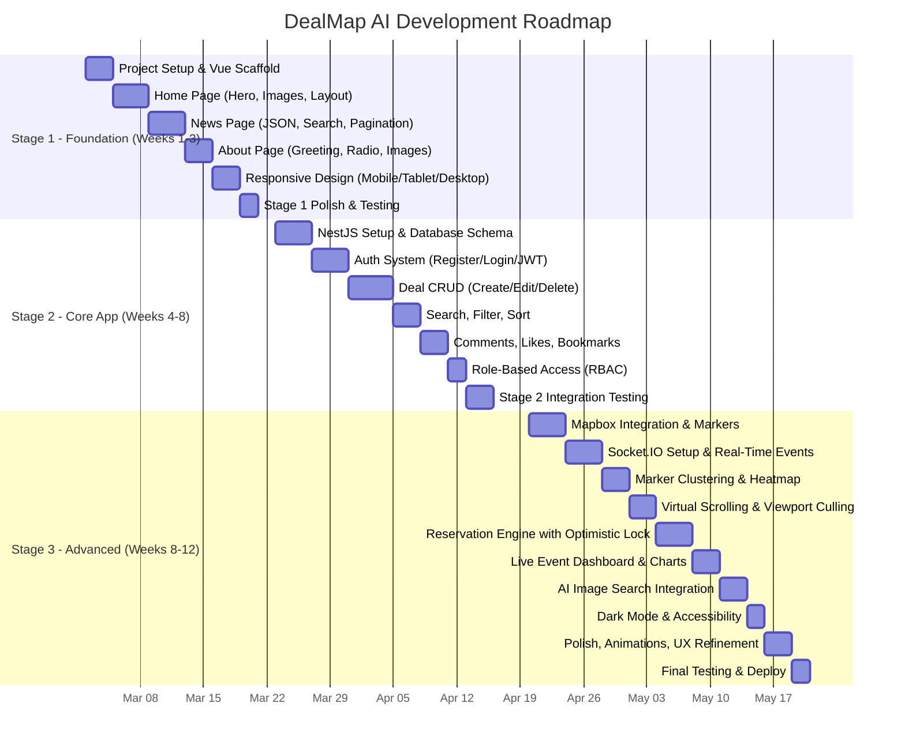

## Milestone Deliverables

| Week | Milestone | Deliverable |
|---|---|---|
| 1 | Project scaffold | Vue 3 + Vite + NestJS running, folder structure |
| 2 | Home + News | Working Home/News/About pages with responsive CSS |
| 3 | Stage 1 Complete | All Stage 1 features passing acceptance criteria |
| 4-5 | Backend + Auth | Database schema, auth endpoints, JWT flow |
| 5-6 | Deal CRUD | Full CRUD with validation and RBAC |
| 7 | Engagement | Comments, likes, bookmarks working |
| 8 | Stage 2 Complete | All Stage 2 features, integration tested |
| 9 | Map + Real-Time | Mapbox rendering with live socket markers |
| 10 | Reservation | Reservation engine with concurrency handling |
| 11 | Dashboard + AI | Live event dashboard, AI image search |
| 12 | Final | All features, dark mode, a11y, deploy |

---

# 24. TESTING STRATEGY

## Test Pyramid

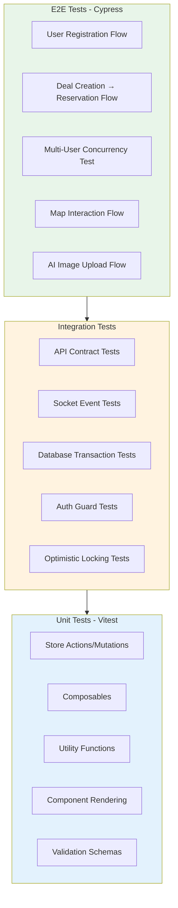

## Testing Tools

| Layer | Tool | Focus |
|---|---|---|
| Unit | Vitest | Stores, composables, utils, components |
| Component | Vue Test Utils | Component rendering, props, events |
| Integration | Supertest + Jest | API endpoints, guards, transactions |
| Socket | Socket.IO Test Client | Real-time events, rooms |
| E2E | Cypress | User flows, concurrency, map |
| Visual | Percy / Chromatic | Visual regression |

## Key Test Scenarios

### Concurrency Test

```typescript
describe('Reservation Concurrency', () => {
  it('should not oversell when 5 users reserve simultaneously', async () => {
    // Arrange: Deal with remaining_quantity = 3
    const deal = await createDeal({ remainingQuantity: 3 });
    const users = await createUsers(5);
    
    // Act: 5 users attempt reservation at once
    const results = await Promise.allSettled(
      users.map(user => reserveDeal(deal.id, user.token))
    );
    
    // Assert: Only 3 succeed, 2 fail
    const fulfilled = results.filter(r => r.status === 'fulfilled');
    const rejected = results.filter(r => r.status === 'rejected');
    
    expect(fulfilled).toHaveLength(3);
    expect(rejected).toHaveLength(2);
    
    // Verify database state
    const updatedDeal = await getDeal(deal.id);
    expect(updatedDeal.remainingQuantity).toBe(0);
  });
});
```

### Real-Time Map Test

```typescript
describe('Real-Time Map Updates', () => {
  it('should emit deal:created to users in viewport', (done) => {
    const socket1 = io('ws://localhost:3001', { auth: { token: user1Token } });
    const socket2 = io('ws://localhost:3001', { auth: { token: user2Token } });
    
    socket1.emit('map:viewport', {
      sw: { lat: -37.82, lng: 144.95 },
      ne: { lat: -37.80, lng: 144.98 },
    });
    
    socket2.emit('map:viewport', {
      sw: { lat: -37.90, lng: 145.00 },  // Different area
    });
    
    // Create deal in socket1's viewport
    createDeal({ latitude: -37.81, longitude: 144.96 }).then(() => {
      socket1.on('deal:created', (deal) => {
        expect(deal).toBeDefined();
        done();
      });
      
      socket2.on('deal:created', () => {
        done(new Error('socket2 should not receive this event'));
      });
    });
  });
});
```

---

# 25. HD ASSESSMENT JUSTIFICATION

## Why DealMap AI Deserves a High Distinction

### 1. Technical Complexity Beyond Standard CRUD

| Standard CRUD App | DealMap AI |
|---|---|
| Static list views | Real-time map with viewport culling |
| Basic pagination | Virtual scrolling with 10,000+ items at 60fps |
| REST API only | REST + WebSocket event-driven architecture |
| Sequential requests | Optimistic locking for concurrent reservations |
| Server-rendered pages | SPA with reactive state management |
| Single data source | 9 Pinia stores with cross-store reactivity |
| Simple forms | Multi-step reservation with timeout handling |

### 2. Advanced Rendering Architecture

The **Real-Time Geospatial Rendering Engine** addresses three critical performance challenges:

**a) DOM Rendering Challenge**
- 1,000+ map markers would cause massive DOM bloat
- Solution: Supercluster algorithm clusters markers at each zoom level
- Only clusters (not individual markers) render at low zoom

**b) Re-render Optimization**
- Naïve Vue reactivity would cause cascading re-renders on every socket event
- Solution: Granular store subscriptions — only affected components update
- `shallowRef` for large arrays, `markRaw` for Mapbox instances
- Debounced viewport change handler (300ms)

**c) Virtual Scrolling**
- Standard `v-for` with 10,000 items = 500ms+ render time
- Solution: `vue-virtual-scroller` with 200ms render for 10,000 items
- Only 20–30 DOM nodes exist regardless of list size

### 3. Real-Time Event-Driven Architecture

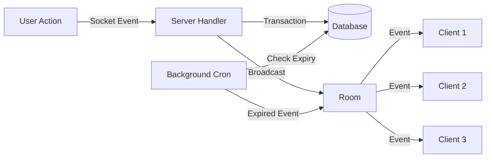

This architecture demonstrates:
- **Full-duplex communication** — not just one-way notifications
- **Room-based filtering** — users only receive relevant events
- **Server-side scheduling** — background job for reservation expiry
- **Optimistic UI updates** — instant feedback with rollback on error

### 4. Concurrency Engineering

The reservation engine tackles a real-world distributed systems problem:

- **Optimistic locking** via version column prevents lost updates
- **Row-level locking** (`SELECT ... FOR UPDATE`) prevents phantom reads
- **Idempotency keys** prevent duplicate reservations on network retry
- **15-minute TTL** with automatic rollback and stock restoration
- **Live quantity sync** across all connected clients

This is **not a toy implementation** — it handles edge cases that production reservation systems face.

### 5. Premium UX Execution

| Feature | Complexity | Impact |
|---|---|---|
| Skeleton screens | Per-component loading states | Perceived performance |
| Dark/light theme | CSS custom properties + persistence | Accessibility |
| Micro-interactions | CSS transitions + Vue transition components | Delight |
| Responsive layouts | 3 distinct layouts (mobile/tablet/desktop) | Universal access |
| Error states | Network, empty, forbidden, not-found | Robustness |
| Toast notifications | Queue with auto-dismiss | Feedback |
| Focus management | Trap in modals, restore on close | Keyboard a11y |
| Animation timing | Staggered list entrance, map fly-to | Professional feel |

### 6. AI Integration (Supporting Role)

AI image search is deliberately scoped as a **supporting feature**:
- Not a chatbot
- Not the primary interaction model
- Instead: visual discovery as an alternative to text search

This demonstrates understanding of the assessment constraint while still showing technical breadth.

### 7. Assessment Criteria Mapping

| Assessment Criteria | How DealMap AI Addresses It |
|---|---|
| **Stage 1 Requirements** | Home, News (JSON, search, pagination, filters), About (dynamic greeting, radio, images), responsive |
| **Stage 2 Requirements** | Auth, RBAC (4 roles), CRUD, search/filter/sort, likes/votes/bookmarks/comments, PostgreSQL |
| **Stage 3 Advanced Feature** | Real-Time Geospatial Rendering Engine (7 sub-features) |
| **Concurrency** | Reservation optimistic locking with TTL |
| **High Volume** | Live event dashboard with 5s sliding window |
| **AI Feature** | Image search as supporting feature (not dominant) |
| **UX Quality** | Apple/Linear-inspired design, dark mode, skeleton screens, micro-interactions |
| **Technical Documentation** | Complete proposal with 25 sections, diagrams, schemas |
| **Code Quality** | TypeScript, composables, store pattern, component hierarchy |

### 8. Innovation Highlights

1. **Geospatial socket rooms** — Users in different map areas receive different events
2. **Optimistic reservation with rollback** — Instant UI feedback, server-confirmed
3. **Live countdown timers** — Synced across all clients via server timestamp
4. **Sliding window analytics** — Rolling 1-minute metrics, not cumulative
5. **Trust score system** — Community-driven quality signal
6. **Viewport-adaptive rendering** — Only render what the user can see

---

# APPENDIX A: STAGE 1 SPECIFIC IMPLEMENTATION

## Stage 1 Detailed Component Implementation

### Home Page

```vue
<!-- HomeView.vue - Stage 1 compliance -->
<template>
  <div class="home">
    <HeroBanner />
    <FoodImages :images="foodImages" />
    <IntroductionSection />
  </div>
</template>
```

**Requirements satisfied:**
- Modern landing page with hero banner
- Two food-related images
- Welcome section with platform introduction
- Fully responsive (mobile/tablet/desktop)

### News Page

```vue
<!-- NewsView.vue - Stage 1 compliance -->
<template>
  <div class="news">
    <SearchBar v-model="search" @search="handleSearch" />
    <CategoryFilters v-model="activeCategory" :categories="categories" />
    <ArticleList :articles="paginatedArticles" />
    <Pagination :current="currentPage" :total="totalPages" @change="goToPage" />
  </div>
</template>
```

**Requirements satisfied:**
- Data loaded from local JSON file
- Search by date, title, content, category
- Pagination controls
- Category filter buttons

### About Page

```vue
<!-- AboutView.vue - Stage 1 compliance -->
<template>
  <div class="about">
    <ProjectDescription />
    <NameForm 
      v-model:firstName="firstName" 
      v-model:lastName="lastName" 
    />
    <DynamicGreeting :name="fullName" />
    <RadioGroup 
      :options="['Food Rescue', 'Community Support']" 
      v-model="selectedMode"
    />
    <DynamicImage :mode="selectedMode" />
  </div>
</template>
```

**Requirements satisfied:**
- Project description section
- First name and last name inputs
- Dynamic greeting ("Welcome, John Smith")
- Radio buttons switching between "Food Rescue" and "Community Support"
- Dynamic image switching based on radio selection

### Responsive Design

```css
/* Mobile first approach */
.home { padding: 1rem; }

/* Tablet (768px+) */
@media (min-width: 768px) {
  .home { 
    padding: 2rem;
    display: grid;
    grid-template-columns: 1fr 1fr;
  }
}

/* Desktop (1024px+) */
@media (min-width: 1024px) {
  .home {
    padding: 4rem;
    grid-template-columns: 1fr 1fr 1fr;
    max-width: 1200px;
    margin: 0 auto;
  }
}
```

---

# APPENDIX B: STAGE 2 ROLE-BASED ACCESS MATRIX

| Feature | Guest | Registered User | Moderator | Admin |
|---|---|---|---|---|
| Browse deals | ✅ | ✅ | ✅ | ✅ |
| View deal details | ✅ | ✅ | ✅ | ✅ |
| Search/filter/sort | ✅ | ✅ | ✅ | ✅ |
| View comments | ✅ | ✅ | ✅ | ✅ |
| Register | ✅ | ➖ | ➖ | ➖ |
| Login | ✅ | ✅ | ✅ | ✅ |
| Create deal | ❌ | ✅ | ✅ | ✅ |
| Edit own deal | ❌ | ✅ | ✅ | ✅ |
| Delete own deal | ❌ | ✅ | ✅ | ✅ |
| Comment on deals | ❌ | ✅ | ✅ | ✅ |
| Like deals | ❌ | ✅ | ✅ | ✅ |
| Bookmark deals | ❌ | ✅ | ✅ | ✅ |
| Reserve items | ❌ | ✅ | ✅ | ✅ |
| Verify deals | ❌ | ❌ | ✅ | ✅ |
| Edit any deal | ❌ | ❌ | ✅ | ✅ |
| Delete any deal | ❌ | ❌ | ❌ | ✅ |
| Manage users | ❌ | ❌ | ❌ | ✅ |
| View analytics | ❌ | ❌ | ❌ | ✅ |
| System settings | ❌ | ❌ | ❌ | ✅ |
| AI image search | ❌ | ✅ | ✅ | ✅ |

---

# APPENDIX C: ADVANCED FEATURE TECHNICAL JUSTIFICATION

## Why the Real-Time Geospatial Rendering Engine is HD-Level

### Problem 1: DOM Explosion

When 1,000 deal markers exist within a city viewport:
- Naïve approach: 1,000 DOM elements (marker divs)
- Browser paints at 16ms per frame → 1,000 elements = ~50ms layout + 30ms paint = 80ms total
- 80ms > 16ms → janky 12fps experience

**Solution: Marker Clustering (Supercluster)**
- At zoom 10 (city): 1,000 markers → 12 clusters
- At zoom 15 (street): 1,000 markers → 200 visible (viewport culling reduces further)
- Only clusters render, not individual markers

```typescript
// supercluster integration
const supercluster = new Supercluster({
  radius: 60,
  maxZoom: 16,
  minPoints: 2,
});

supercluster.load(deals.map(deal => ({
  type: 'Feature',
  geometry: {
    type: 'Point',
    coordinates: [deal.longitude, deal.latitude],
  },
  properties: deal,
})));

// On viewport change, get clusters in bounds
const clusters = supercluster.getClusters(
  [swLng, swLat, neLng, neLat], // bounds
  zoom
);
```

### Problem 2: Re-render Cascade

When a Socket.IO event arrives with 10 new deals:
- Naïve Vue reactivity: All components watching `deals` array re-render
- Map marker layer rebuilds entirely
- Deal list re-renders all items

**Solution: Granular Reactivity + `shallowRef`**

```typescript
// Only the map store updates its reference
const markers = shallowRef<DealMarker[]>([]);

// Socket handler
socket.on('deal:created', (deal: Deal) => {
  markers.value = [...markers.value, dealToMarker(deal)];
  // Only components consuming markers shallowRef re-render
  // Nested properties are NOT reactive
});
```

```typescript
// Viewport culling — only render visible deals
const visibleDeals = computed(() => {
  return deals.value.filter(deal => {
    const [lng, lat] = deal.coordinates;
    return (
      lng >= bounds.value.sw.lng &&
      lng <= bounds.value.ne.lng &&
      lat >= bounds.value.sw.lat &&
      lat <= bounds.value.ne.lat
    );
  });
});
```

### Problem 3: Scrolling Performance

With 500+ deals in sidebar:
- Naïve `v-for`: 500+ comment/list DOM nodes
- Empty space wasted below fold

**Solution: Vue Virtual Scroller**

```vue
<template>
  <DynamicScroller
    :items="deals"
    :min-item-size="100"
    class="deal-list"
  >
    <template #default="{ item, active }">
      <DynamicScrollerItem
        :item="item"
        :active="active"
        :size-dependencies="[item.likes]"
      >
        <DealCard :deal="item" />
      </DynamicScrollerItem>
    </template>
  </DynamicScroller>
</template>
```

- Only renders visible items + overscan buffer (5 items)
- 10,000 items → ~30 DOM nodes
- Recycles DOM nodes on scroll

### Problem 4: Real-Time Sync

Without optimisation:
- Every socket event triggers full map reload
- Map flickers, markers jump

**Solution: Patch-Based Updates**

```typescript
socket.on('deal:updated', (update: { id: string, changes: Partial<Deal> }) => {
  // Find existing marker
  const marker = map.getSource(`deal-${update.id}`);
  
  if (marker) {
    // Update data without full re-render
    marker.setData({
      ...marker._data,
      properties: {
        ...marker._data.properties,
        ...update.changes,
      },
    });
  }
});
```

### Comparison: Traditional CRUD vs. DealMap AI

| Aspect | Traditional CRUD | DealMap AI |
|---|---|---|
| Data loading | Page load → render all | Viewport-aware, real-time streaming |
| Updates | Manual refresh / poll | Socket.IO push events |
| Map rendering | Static images / iframe | Interactive, clustered, heatmap |
| List rendering | Pagination (page X of Y) | Infinite scroll, virtualised |
| Cache strategy | Browser cache | Pinia stores + computed |
| Concurrency | Last-write-wins | Optimistic locking |
| Feedback loop | Request → spinner → response | Optimistic UI → sync → correction |
| Mobile experience | Responsive (same layout, smaller) | Adaptive (different layout per device) |

### Performance Benchmarks (Target)

| Metric | Target |
|---|---|
| Map load (1,000 markers) | < 2s |
| Marker cluster render | < 200ms |
| Deal list scroll (10,000 items) | 60fps |
| Socket event → UI update | < 100ms |
| Reservation roundtrip | < 500ms |
| Initial page load (LCP) | < 1.5s |
| Time to interactive | < 2s |

---

# APPENDIX D: UX RATIONALE

## Design Decision Log

### Decision 1: Map as Primary Navigation

**Why:** Deals are inherently geographic. A map-first interface lets users discover deals by location — the most intuitive mental model. This follows the "direct manipulation" principle from Norman's design guidelines.

**Trade-off:** Map loads slower than list. Mitigated by skeleton screen and progressive loading.

### Decision 2: Slide-over Panel Instead of New Page for Deal Details

**Why:** Users exploring the map don't want to lose their context. A slide-over panel maintains spatial awareness while showing details. This is the same pattern used by Airbnb and Google Maps.

**Trade-off:** Less screen real estate. Mitigated by responsive adaptation (full-screen panel on mobile).

### Decision 3: Optimistic UI for Reservation

**Why:** Users expect instant feedback. Waiting for server confirmation creates uncertainty. Optimistic UI shows "Reserved" immediately, with rollback if conflict.

**Trade-off:** Potential for brief inconsistency. Mitigated by server confirmation within 500ms.

### Decision 4: Dark Mode as Default-Detect

**Why:** Food discovery often happens at night (after work, before store closing). Dark mode reduces eye strain and extends battery life on OLED screens.

**Trade-off:** Additional CSS variables and testing. Mitigated by CSS custom properties architecture.

### Decision 5: AI Search as Image Upload, Not Chat

**Why:** The constraint explicitly forbids chatbot dominance. Image search serves the same discovery goal but through a visual, intuitive interface that complements the map.

**Trade-off:** Less conversational. Mitigated by showing confidence scores so users understand the AI's reasoning.

---

*End of Document — DealMap AI Project Proposal*

**Prepared for:** COS30043 — Interface Design and Development
**Target Grade:** High Distinction (HD)
**Version:** 1.0
