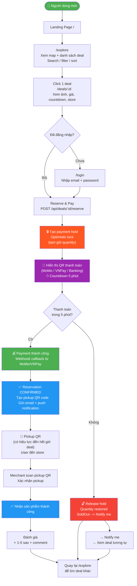

---

## Các bước tóm tắt

```
1  → Landing Page (xem featured deals)
2  → Explore Map (tìm deal gần đây)
3  → Deal Detail (xem thông tin + giá)
4  → Login / Register (nếu chưa có)
5  → Reserve & Pay → tạo payment hold, giữ quantity
6  → QR thanh toán (MoMo/VNPay) → countdown 5 phút
7  → Nếu không thanh toán → release hold, restore quantity
8  → Nếu thanh toán thành công → CONFIRMED, tạo pickup QR
9  → Đến store → merchant scan pickup QR → nhận sản phẩm
10 → Review + đánh giá
```

---

## Mermaid text thuần (chỉ copy code)

```
flowchart TD
    Start(["👤 Người dùng mới"]) --> Landing["Landing Page /"]
    Landing --> Browse["/explore\nXem map + danh sách deal\nSearch / filter / sort"]
    Browse --> ViewDeal["Click 1 deal\n/deals/:id\nXem ảnh, giá, countdown, store"]
    ViewDeal --> CheckLogin{"Đã đăng nhập?"}
    CheckLogin -->|Chưa| Login["/login\nNhập email + password"]
    CheckLogin -->|Rồi| Reserve["Reserve & Pay\nPOST /api/deals/:id/reserve"]
    Login --> Reserve
    Reserve --> Hold["🔒 Tạo payment hold\nOptimistic lock\n(tạm giữ quantity)"]
    Hold --> PaymentQR["📱 Hiển thị QR thanh toán\n(MoMo / VNPay / Banking)\n⏱ Countdown 5 phút"]
    PaymentQR --> WaitPay{"Thanh toán\ntrong 5 phút?"}
    WaitPay -->|Không| ReleaseHold["🔓 Release hold\nQuantity restored"]
    WaitPay -->|Có| PaymentSuccess["💰 Payment thành công\nWebhook callback từ MoMo/VNPay"]
    PaymentSuccess --> ConfirmReservation["✅ Reservation CONFIRMED\nTạo pickup QR code\nGửi email + push notification"]
    ConfirmReservation --> Pickup["📱 Pickup QR\n(có hiệu lực đến hết giờ deal)\nUser đến store"]
    Pickup --> ScanQR["Merchant scan pickup QR\nXác nhận pickup"]
    ScanQR --> Done["✅ Nhận sản phẩm thành công"]
    Done --> Review["Đánh giá\n⭐ 1-5 sao + comment"]
    Review --> BackBrowse["Quay lại /explore\nđể tìm deal khác"]
    ReleaseHold --> BackBrowse
    ReleaseHold --> SoldOut["→ Notify me\n→ Xem deal tương tự"]
    SoldOut --> BackBrowse
```
