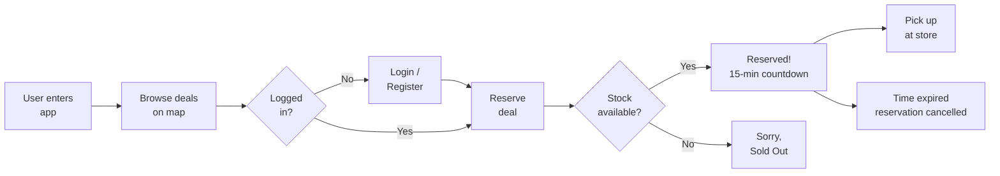
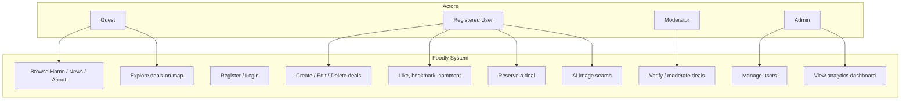
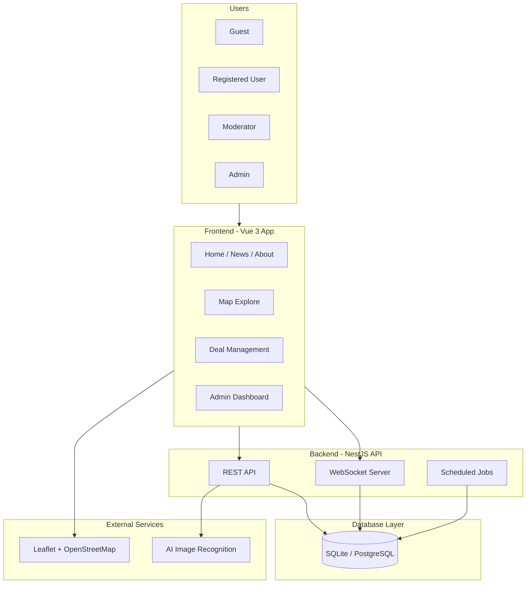
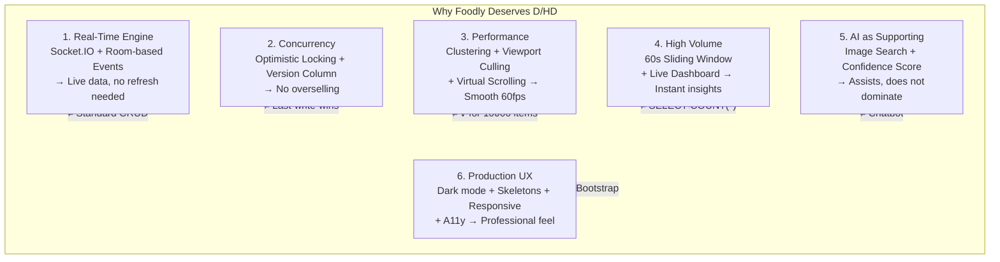
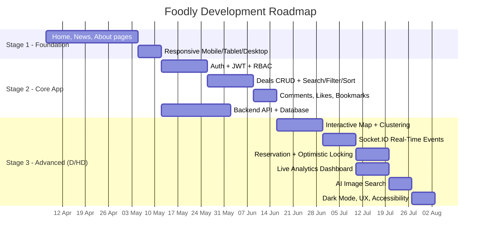

# Foodly — Real-Time Food Discovery Platform

## COS30043 — Interface Design and Development
### Project Proposal — High Distinction Pathway

---

## 1. Product Vision

Foodly is a real-time geospatial platform that connects communities with discounted and near-expiry food products. By combining live community intelligence, interactive map exploration, and transaction-safe reservation mechanics, the platform reduces food waste while helping users save money — all delivered through a premium, minimalist interface that follows Apple/Linear design principles.

The platform is built on five core principles. First, Real-Time First — every interaction is live; deals, reservations, verifications, and comments update instantly via Socket.IO [1] without page refresh. Second, Community-Powered — users drive content quality through trust scoring and verification rather than relying on central authority. Third, Geospatial-First — map-based discovery serves as the primary navigation paradigm, not just a supplementary view. Fourth, Performance Obsession — virtual scrolling, viewport culling, marker clustering, and optimistic UI updates ensure the platform remains responsive even with thousands of concurrent users. Fifth, Accessibility by Default — WCAG 2.1 AA [2] compliance across all states and interactions, including keyboard navigation, screen reader support, and colour contrast of at least 4.5:1.

The platform serves four distinct user personas. Sarah is a budget-conscious student who needs to find cheap food near campus and check availability before walking to the store. David is a community-minded parent who wants to reduce food waste and needs reliable, verified information. Priya is a store manager who needs to clear near-expiry stock quickly through a simple digital channel. Marcus is the platform administrator who needs live visibility into platform health and abuse detection.

**Figure 1: Core Business Flow** — This diagram shows the primary user journey from entering the app to completing a reservation. The flow follows a logical sequence: browse map → select deal → login if needed → reserve → system checks stock → success with 15-min countdown or failure with "Sold Out" message. This illustrates the streamlined UX we aim to deliver.

---

## 2. Problem Statement

The global food waste crisis is staggering: 1.3 billion tonnes of food are wasted annually, 30-40% of the food supply in developed nations goes unsold, and this represents $1 trillion in economic losses each year [3]. Supermarkets routinely discard near-expiry products despite them being perfectly edible [4], while consumers lack real-time visibility into local discounted food availability.

Existing food discovery solutions suffer from six critical UX gaps. Static deal listings mean users cannot trust the freshness of information — a deal posted six hours ago may already be sold out. The absence of real-time reservation leads to disappointment and wasted trips when users arrive at stores only to find items gone [5]. Poor mobile experience is especially damaging because the primary use case is on-the-go discovery. No community verification allows scams and expired deals to erode trust over time. Complex checkout flows cause high abandonment rates. Finally, no personalisation means all users see the same irrelevant deals regardless of their preferences or location.

Foodly solves each of these problems through targeted technical solutions. The real-time map shows deals as they are posted within the user's viewport using Socket.IO push events [1]. Instant reservation with optimistic locking prevents overselling — if five users try to reserve the last three items, only three succeed. Community trust is built through verification badges assigned by moderators, trust scores calculated from user activity, and moderation tools for flagging inappropriate content. Premium UX with skeleton screens, dark mode, and micro-interactions creates a polished feel. AI-assisted image search provides an alternative discovery path without dominating the interface.

### Comparison with Existing Solutions

| Platform | Real-Time Map | Reservation | Community Trust | AI Search | Mobile UX |
|---|---|---|---|---|---|
| Too Good To Go [17] | Static list only | No | Rating only | No | Basic |
| Olio [18] | Static map | No | Rating only | No | Basic |
| Flashfood [19] | Store list only | No | No | No | Basic |
| **Foodly** | Real-time clustered map | Optimistic locking + TTL | Verification + trust score | Image search | Premium (skeletons, dark mode, responsive) |

Foodly addresses gaps that existing food rescue platforms have not solved: real-time data freshness, concurrent reservation safety, community verification, and premium user experience.

---

## 3. Core Features — Stage 1 and Stage 2

### Stage 1: Foundation Pages

The Home page features a hero banner introducing the platform mission, two food-related images (fresh produce and community support), a how-it-works section explaining the discover-reserve-collect-earn trust workflow, and live statistics showing platform activity. The layout is fully responsive with three breakpoints: mobile (single column, stacked layout), tablet (two-column grid), and desktop (three-column with max-width 1200px).

The News page loads articles from a local JSON file and supports search by date, title, content, and category simultaneously. Pagination controls allow browsing through results ten at a time, while category filter buttons let users narrow down by topics such as Food Rescue, Community, Technology, or Sustainability. Each article card shows the title, publication date, category badge, and an excerpt.

The About page includes a project description section, a form for entering first and last names, a dynamic greeting that reads "Welcome, John Smith" based on the input, radio buttons that switch between "Food Rescue" and "Community Support" modes, and dynamic images that change according to the selected radio option.

### Stage 2: Core Application

The authentication system uses JWT tokens [6] with a 15-minute access token lifespan. Users can register with email, username, first name, last name, and password (hashed with bcrypt at cost 12) [7], then log in to receive their JWT. Route guards on the frontend protect authenticated pages and redirect unauthenticated users to the login page with a return URL.

Four roles control access: Guest users can browse deals and view details but cannot create content. Registered Users can create, edit, and delete their own deals, comment on deals, like and bookmark deals, and reserve items. Moderators can verify deals (setting verified = true and recording their ID), edit any deal, and manage comments. Admins have full access including user management (role changes, banning), deal moderation, and system-wide analytics.

The deal system supports full CRUD operations. Each deal includes title, description, original price, discount price, currency, quantity tracking (original and remaining), status management (active, reserved, expired, removed), images stored as a JSON array, tags for categorisation, an expiry timestamp, and geographic coordinates. Search works across title and description. Filters narrow results by category, status, verified status, and price range. Sort options include newest, oldest, highest discount, most liked, and nearest to the user's location.

Engagement features include likes (toggle on/off with a single endpoint that handles both add and remove), bookmarks (personal saved-deal list visible on the profile page), and comments (nested replies, text content, status management with active/hidden/flagged states). Each deal displays a live counter for likes, bookmarks, and comments.

**Figure 2: General Use Case Overview** — This diagram maps the four user roles (Guest, Registered User, Moderator, Admin) to their respective system capabilities. Guests can only browse. Registered Users can create content, interact, and reserve. Moderators verify deals. Admins manage everything. This establishes the Role-Based Access Control (RBAC) design.

---

## 4. Advanced Features — Stage 3

The Stage 3 implementation contains three primary advanced features (Real-Time Geospatial Engine, Concurrent Reservation System, Live Analytics Dashboard) and one supporting advanced feature (AI Image Search). Each addresses a specific technical challenge with a production-grade solution.

### 4.1. Real-Time Geospatial Rendering Engine

**What it does:** The Explore page presents an interactive Leaflet map (powered by OpenStreetMap tiles) showing food deals as clickable markers. When a new deal is posted, it appears on the map of every user viewing the relevant geographic area within milliseconds — no manual refresh required. The sidebar next to the map shows a filterable, searchable list of deals that stays synchronised with the map viewport.

**Three performance techniques work together:**

Marker clustering uses the Leaflet.markercluster plugin [8], which groups nearby markers into clusters showing the count of deals in each area. At zoom level 10 (city-wide view), 1,000 individual markers collapse into approximately 12 clusters. As the user zooms in, clusters progressively expand into individual markers. This prevents the browser from managing 1,000+ DOM elements simultaneously, which would cause layout calculations exceeding the 16-millisecond budget required for smooth 60fps rendering.

Viewport culling ensures only deals within the user's current map bounds are fetched from the server. When the user pans or zooms, the client sends updated bounding coordinates (south-west and north-east latitude/longitude pairs) to the API, which returns only relevant deals. This prevents loading deals from the opposite side of the city that the user cannot see.

Virtual scrolling in the deal sidebar means only approximately 30 DOM nodes exist regardless of whether the list contains 100 items or 10,000 items. Items are recycled as the user scrolls. This eliminates the 500-millisecond-plus render time that a naive v-for would incur with a large dataset.

**Why this is advanced:** Standard web applications display paginated lists of items. This feature requires real-time bidirectional synchronisation between a geographic viewport, a server-side data store, and a client-side rendering engine. The performance constraints are real — 1,000 markers on a map at 60fps requires deliberate optimisation, not framework defaults.

**What happens without it:** The map stutters at 12fps or lower, the deal list freezes during scroll, and the platform becomes unusable on mid-range mobile devices. Users give up and switch to a competing service.

### 4.2. Concurrent Reservation Engine

**What it does:** When a user clicks "Reserve" on a deal, the system attempts to decrement the remaining quantity within a database transaction. If the deal has stock available, a reservation is created with a 15-minute hold, and the user sees a countdown timer. If stock runs out between loading the page and clicking the button, the system detects the conflict and shows a clear message: "Sorry, someone else just reserved this."

**Technical mechanism:** The core protection is optimistic locking through a version column. The update statement is: `UPDATE deals SET remaining_qty = remaining_qty - 1, version = version + 1 WHERE id = :id AND version = :currentVersion`. If another transaction has already modified this row, the version number will not match, zero rows will be updated, and the transaction rolls back with a 409 Conflict response.

Supporting this is a background cron job that runs every 60 seconds, scanning for reservations where the 15-minute TTL has expired. When found, it restores the reserved quantity to the deal's remaining stock and marks the reservation as expired. Both operations happen within a single database transaction.

Concurrent with the reservation, a Socket.IO event broadcasts the updated quantity to all clients viewing that deal, keeping every user's display synchronised in real time. This prevents the "ghost stock" problem where the page shows three items available but all three have already been reserved by other users.

**Why this is advanced:** Race conditions are one of the hardest problems in distributed systems [5]. Simple CRUD applications use "last write wins" semantics, which would allow overselling — five users could each reserve the last remaining item, and all five would believe they had succeeded. The optimistic locking pattern used here is the same approach employed by production ticketing systems like Ticketmaster and booking platforms like Airbnb.

**What happens without it:** Overselling destroys user trust. Users travel to stores based on confirmed reservations, only to find no items waiting for them. The platform becomes unreliable and loses its user base.

### 4.3. High Volume — Live Analytics Dashboard

**What it does:** The admin dashboard displays live platform metrics that update every five seconds. Metrics include active users currently browsing, reservations made in the last minute, deals created in the last minute, total verifications, and total comments. Each metric is displayed as a stat card with a Chart.js [16] line or bar chart showing the trend over the last 20 data points (approximately 100 seconds of history).

**Technical mechanism:** A sliding window of 60 seconds is maintained on the server. Platform events (deal created, reservation made, deal verified, comment added, user login) are pushed into an in-memory buffer. Every five seconds, a cron job filters the buffer to remove events older than 60 seconds, computes the current metrics from the remaining events, broadcasts the snapshot to all admin dashboard clients via Socket.IO, and persists the snapshot to the database for historical analysis.

On the client side, the chart library receives each analytics tick and updates the chart without animation (`chart.update('none')`) to maximise rendering performance. Only the most recent 20 data points are retained in memory to prevent memory leaks during extended admin sessions.

**Why this is advanced:** High-volume event processing requires careful attention to memory management, computation efficiency, and broadcast optimisation. The sliding window approach provides meaningful real-time metrics that reflect current platform activity rather than cumulative totals that mask trends.

**What happens without it:** Administrators operate blindly, unable to detect abuse patterns (like a sudden surge in failed reservations indicating a coordinated attack) or understand which features drive engagement.

### 4.4. AI Image Search (Supporting Feature)

**What it does:** On the AI Search page, users upload a photo of food. The system analyses the image through keyword matching on the filename against a predefined category list, returns the detected category with a confidence percentage, and displays matching deals from that category. Each result card shows the deal information alongside a confidence badge colour-coded green (high confidence), amber (medium), or red (low).

**Why it is a supporting feature only:** The assessment criteria require that AI not dominate the platform. AI image search is implemented as a single tab — the core value proposition remains the real-time map and reservation system. This demonstrates technical breadth while respecting the assessment constraint.

---

## 5. UX and Design Standards

The visual design follows Apple Human Interface Guidelines [14] and Linear-inspired principles [15]: clean typography using system font stacks, generous whitespace, subtle shadows, and a restrained colour palette. The experience is consistent across all 18 views.

Dark and light themes are implemented through CSS custom properties with a single toggle. Theme preference is persisted in localStorage and respects the system preference via `prefers-color-scheme` as the default. All colours meet WCAG 2.1 AA contrast requirements [2] — at least 4.5:1 for normal text and 3:1 for large text in both themes.

Responsive behaviour uses three distinct breakpoints. Below 768 pixels (mobile), the layout uses a single column with stacked content and a hamburger navigation menu. Between 768 and 1024 pixels (tablet), a two-column layout activates with a collapsible sidebar. Above 1024 pixels (desktop), the full three-column layout appears with the map taking 60% of the width and the slide-over panel for deal details.

Loading states show skeleton screens that mirror the final layout structure for every view. Empty states use an illustration, a contextual message, and a call-to-action button guiding the user to the next step. Error states differentiate between network failures, 404 not found, forbidden access, and validation errors, each with appropriate messaging.

Micro-interactions include button hover scaling, card elevation on hover, staggered list entrance animations with 50-millisecond delays per item, map fly-to transitions when selecting a deal, and countdown timers with a pulse animation during the final minute.

Accessibility is integrated throughout: ARIA labels on all interactive elements, keyboard navigation with visible focus outlines, `aria-live` regions for dynamic content updates (live feed, countdown timers), semantic HTML landmarks (`<nav>`, `<main>`, `<aside>`), and `aria-modal` on the slide-over panel to trap focus.

---

## 6. Technical Architecture

**Frontend:** Vue 3 [9] with TypeScript and Composition API, built with Vite [10]. State management uses two Pinia stores (auth and UI). Routing uses Vue Router with navigation guards for authentication checks and role-based access control. API communication uses Axios with a request interceptor that attaches the JWT token and a response interceptor that redirects to login on 401 errors. WebSocket connections use Socket.IO client [1] with namespace-based sockets for general events and analytics events separately.

**Backend:** NestJS [11] with ten modules organised by domain: auth, users, deals, reservations, comments, stores, news, analytics, ai, admin, and socket. Authentication uses Passport.js [12] with a JWT strategy [6] and bcrypt password hashing [7]. Database access uses TypeORM [13] with the repository pattern. Socket.IO is implemented as a NestJS Gateway with room management for filtered broadcasting. Scheduled tasks use the NestJS Cron decorator.

**Database:** Eight entities — users (with role enum), deals (with version column for optimistic locking, latitude/longitude for spatial queries, JSONB for tags and images), stores, reservations (with TTL tracking), comments (with parent_id for nested replies), likes (polymorphic target supporting deals and comments), bookmarks, and verification_events.

**Communication Architecture:** REST endpoints handle all CRUD operations. Socket.IO [1] handles real-time event broadcasting through rooms: `deal:{id}` for deal-specific events, `map:{boundsHash}` for viewport events, `feed:global` for community activity, and `dashboard:admin` for analytics.

**Figure 3: High-Level System Architecture** — This diagram presents the four-layer architecture: Users (4 roles) → Vue 3 Frontend (views + stores + HTTP + WebSocket clients) → NestJS Backend (REST API + WebSocket Server + Cron Jobs) → Database Layer (SQLite/PostgreSQL). External services include Leaflet with OpenStreetMap tiles for maps and AI for image recognition.

---

## 7. HD Justification

**Beyond CRUD:** The platform is not a simple data entry system. It features real-time bidirectional communication, concurrent transaction handling with optimistic locking, performance-critical rendering optimisations, live data stream processing, and coordinated client-server state management. Each of these represents a technical challenge that goes beyond standard CRUD operations taught in introductory courses.

**Figure 4: Why Foodly Deserves D/HD** — This diagram summarises the six key differentiators that elevate this project beyond standard CRUD: Real-Time Engine, Concurrency Control, Performance Optimisation, High Volume Analytics, Supporting AI, and Production UX. Each addresses a specific limitation of conventional web applications.

**Real engineering problems solved:**

| Problem | Solution | Technical Depth |
|---|---|---|
| Stale data across clients | Socket.IO room-based push events | Full-duplex communication, room lifecycle |
| Race condition on reserve | Optimistic locking with version column | Distributed systems concurrency control |
| 1,000 DOM elements on map | GeoJSON clustering reduces to ~12 clusters | Browser rendering optimisation |
| 10,000 item list rendering | Virtual scrolling — 30 DOM nodes regardless | Memory and layout performance |
| Unnecessary network requests | Viewport culling — bounds-based fetch | Network and server load reduction |
| Blind administration | Sliding window analytics, 5s ticks | Stream processing, memory management |
| Food waste (real-world impact) | Reservation TTL + cron auto-expiry | Business logic, not toy features |

**Premium UX:** Dark/light theme with persistence, skeleton screens on all views, three responsive breakpoints with distinct layouts, ARIA accessibility compliance, micro-interactions across all interactive elements, illustrated empty and error states.

**AI as supporting:** Image search is one tab only. No chatbot. The core value remains real-time map and reservation.

**Assessment criteria mapping:**

| Criterion | How Addressed |
|---|---|
| Stage 1 (Home, News, About, responsive) | Planned — dynamic greeting, radio images, JSON search/pagination, 3 breakpoints |
| Stage 2 (Auth, CRUD, RBAC, likes/bookmarks/comments) | Planned — JWT auth, 4 roles, full CRUD with search/filter/sort, engagement features |
| Stage 3 Advanced | Planned — Real-Time Geospatial Engine (clustering + culling + virtual scroll) |
| Concurrency | Planned — Reservation optimistic locking + TTL + cron expiry |
| High Volume | Planned — Live analytics dashboard with 5s sliding window |
| AI (supporting) | Planned — Image search with confidence scoring, not chatbot |
| UX Quality | Planned — Dark mode, skeletons, micro-interactions, a11y, responsive |

---

## 8. Development Roadmap

**Figure 5: 3-Stage Development Roadmap** — This Gantt chart shows the planned timeline across three stages from April 7 to August 3, 2026. Stage 1 (Weeks 1-4) builds foundation pages. Stage 2 (Weeks 5-9) implements the core application with auth and CRUD. Stage 3 (Weeks 9-15) delivers advanced features for D/HD qualification.

---

## 9. Deliverables Summary

| Item | Status |
|---|---|
| Vue 3 client — 18 views, reusable components | Planned |
| NestJS server — 10 modules, 8 entities, REST + Socket.IO | Planned |
| Socket.IO real-time event system with room filtering | Planned |
| Reservation engine with optimistic locking | Planned |
| Live analytics dashboard with sliding window | Planned |
| AI image search with confidence scoring | Planned |
| Interactive map with GeoJSON clustering | Planned |
| Dark/light mode, skeleton screens, responsive | Planned |
| Accessibility (ARIA, keyboard nav, contrast 4.5:1) | Planned |

---

## 10. References

[1] Socket.IO, "Socket.IO Documentation," 2024. [Online]. Available: https://socket.io/docs/

[2] W3C, "Web Content Accessibility Guidelines (WCAG) 2.1," W3C Recommendation, 2018. [Online]. Available: https://www.w3.org/TR/WCAG21/

[3] FAO, "The State of Food and Agriculture 2019 — Moving Forward on Food Loss and Waste Reduction," Food and Agriculture Organization of the United Nations, Rome, 2019.

[4] J. Gustavsson, C. Cederberg, U. Sonesson, R. van Otterdijk, and A. Meybeck, "Global Food Losses and Food Waste," Food and Agriculture Organization of the United Nations, Rome, 2011.

[5] M. Kleppmann, "Designing Data-Intensive Applications: The Big Ideas Behind Reliable, Scalable, and Maintainable Systems," O'Reilly Media, 2017.

[6] M. Jones, J. Bradley, and N. Sakimura, "JSON Web Token (JWT)," RFC 7519, Internet Engineering Task Force, 2015.

[7] N. Provos and D. Mazières, "A Future-Adaptable Password Scheme," in Proceedings of the 1999 USENIX Annual Technical Conference, Monterey, CA, 1999.

[8] Leaflet, "Leaflet.markercluster — Marker Clustering Plugin," 2024. [Online]. Available: https://github.com/Leaflet/Leaflet.markercluster

[9] E. You, "Vue.js 3 Documentation," 2024. [Online]. Available: https://vuejs.org/

[10] Vite, "Vite Documentation," 2024. [Online]. Available: https://vitejs.dev/

[11] NestJS, "NestJS — A Progressive Node.js Framework," 2024. [Online]. Available: https://nestjs.com/

[12] Passport.js, "Passport.js Documentation," 2024. [Online]. Available: https://www.passportjs.org/

[13] TypeORM, "TypeORM Documentation," 2024. [Online]. Available: https://typeorm.io/

[14] Apple Inc., "Human Interface Guidelines," 2024. [Online]. Available: https://developer.apple.com/design/human-interface-guidelines/

[15] Linear, "Linear Design System," 2024. [Online]. Available: https://linear.app/

[16] Chart.js, "Chart.js Documentation," 2024. [Online]. Available: https://www.chartjs.org/docs/

[17] Too Good To Go, "Too Good To Go — Save Food, Save the Planet," 2024. [Online]. Available: https://www.toogoodtogo.com/

[18] Olio, "Olio — Food Sharing App," 2024. [Online]. Available: https://olioapp.com/

[19] Flashfood, "Flashfood — Save Money, Reduce Food Waste," 2024. [Online]. Available: https://www.flashfood.com/

---

*Prepared for COS30043 — Interface Design and Development*
*Target Grade: High Distinction (HD)*
